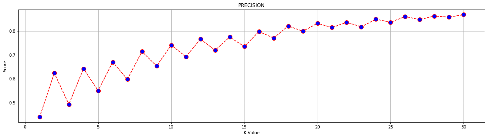
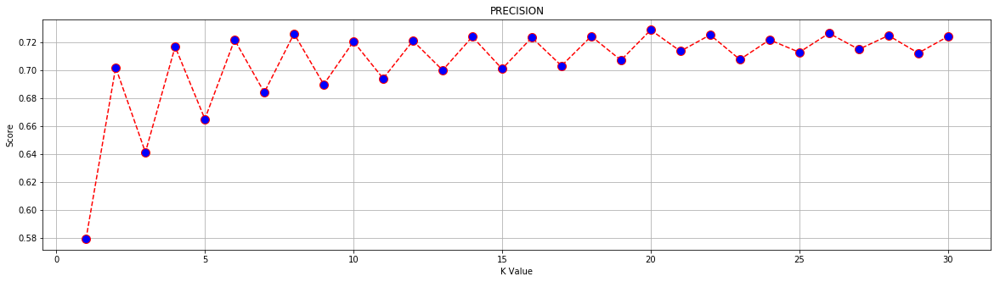
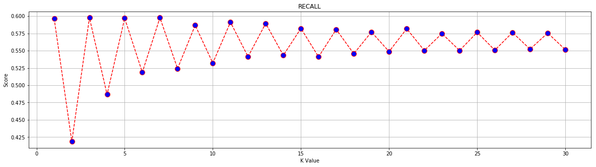
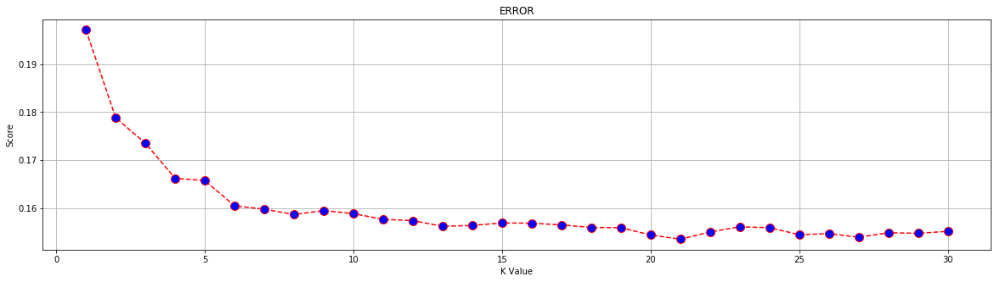
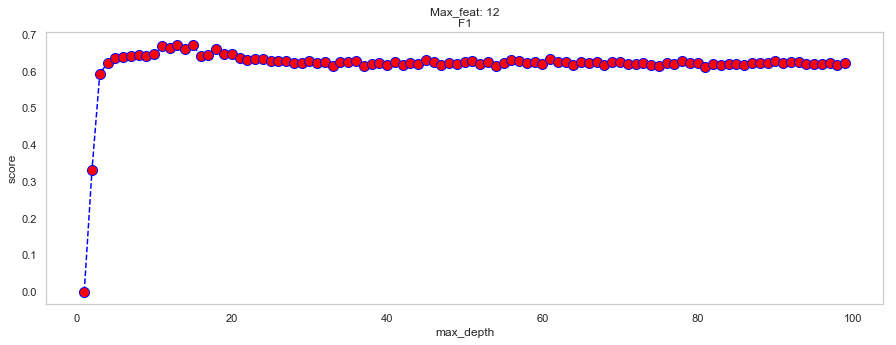

# Classification Modeling 

# Abstract

In this project, we will explore classification modeling using K-nearest neighbors (KNN) and Decision Trees.  We will also be using the dataset below to see how we can build and tune our models for optimal performance.


### Dataset

In this project, we will build a classification model using K-Nearest Neighbors(KNN) and Decision Trees, utilizing the following dataset:  https://www.openml.org/d/1590
The information from the dataset was originally derived from the Census Bureau surveys in 1996.  

For more information on the features available within the dataset, refer to the link above.

### Import files


```python
import numpy as np
import pandas as pd
import seaborn as sns
import matplotlib.pyplot as plt
import plotly.graph_objs as go
from mpl_toolkits.mplot3d import Axes3D
from sklearn.svm import SVC
from sklearn.model_selection import GridSearchCV
from sklearn import preprocessing
from sklearn.decomposition import PCA
from sklearn.model_selection import train_test_split
from sklearn.neighbors import KNeighborsClassifier
from sklearn.metrics import f1_score, precision_score, accuracy_score, fbeta_score, recall_score
from sklearn.tree import DecisionTreeClassifier 
from sklearn.tree import export_graphviz
from IPython.display import Image  
from sklearn.tree import export_graphviz
from pydotplus import graph_from_dot_data

%matplotlib inline
%load_ext autoreload
%autoreload
```


```python
data = pd.read_csv('./data/phpMawTba.csv')
```

## Data Cleaning

Since this file was initally mined by someone else, it was relatively clean and ordered.
There were some additional operations needed to put the data in the proper format and to type cast certain columns.


```python
data.head()
```


<div>
<style scoped>
    .dataframe tbody tr th:only-of-type {
        vertical-align: middle;
    }

    .dataframe tbody tr th {
        vertical-align: top;
    }

    .dataframe thead th {
        text-align: right;
    }
</style>
<table border="1" class="dataframe">
  <thead>
    <tr style="text-align: right;">
      <th></th>
      <th>age</th>
      <th>workclass</th>
      <th>fnlwgt</th>
      <th>education</th>
      <th>education-num</th>
      <th>marital-status</th>
      <th>occupation</th>
      <th>relationship</th>
      <th>race</th>
      <th>sex</th>
      <th>capital-gain</th>
      <th>capital-loss</th>
      <th>hours-per-week</th>
      <th>native-country</th>
      <th>class</th>
    </tr>
  </thead>
  <tbody>
    <tr>
      <th>0</th>
      <td>25</td>
      <td>Private</td>
      <td>226802</td>
      <td>11th</td>
      <td>7</td>
      <td>Never-married</td>
      <td>Machine-op-inspct</td>
      <td>Own-child</td>
      <td>Black</td>
      <td>Male</td>
      <td>0</td>
      <td>0</td>
      <td>40</td>
      <td>United-States</td>
      <td>&lt;=50K</td>
    </tr>
    <tr>
      <th>1</th>
      <td>38</td>
      <td>Private</td>
      <td>89814</td>
      <td>HS-grad</td>
      <td>9</td>
      <td>Married-civ-spouse</td>
      <td>Farming-fishing</td>
      <td>Husband</td>
      <td>White</td>
      <td>Male</td>
      <td>0</td>
      <td>0</td>
      <td>50</td>
      <td>United-States</td>
      <td>&lt;=50K</td>
    </tr>
    <tr>
      <th>2</th>
      <td>28</td>
      <td>Local-gov</td>
      <td>336951</td>
      <td>Assoc-acdm</td>
      <td>12</td>
      <td>Married-civ-spouse</td>
      <td>Protective-serv</td>
      <td>Husband</td>
      <td>White</td>
      <td>Male</td>
      <td>0</td>
      <td>0</td>
      <td>40</td>
      <td>United-States</td>
      <td>&gt;50K</td>
    </tr>
    <tr>
      <th>3</th>
      <td>44</td>
      <td>Private</td>
      <td>160323</td>
      <td>Some-college</td>
      <td>10</td>
      <td>Married-civ-spouse</td>
      <td>Machine-op-inspct</td>
      <td>Husband</td>
      <td>Black</td>
      <td>Male</td>
      <td>7688</td>
      <td>0</td>
      <td>40</td>
      <td>United-States</td>
      <td>&gt;50K</td>
    </tr>
    <tr>
      <th>4</th>
      <td>18</td>
      <td>?</td>
      <td>103497</td>
      <td>Some-college</td>
      <td>10</td>
      <td>Never-married</td>
      <td>?</td>
      <td>Own-child</td>
      <td>White</td>
      <td>Female</td>
      <td>0</td>
      <td>0</td>
      <td>30</td>
      <td>United-States</td>
      <td>&lt;=50K</td>
    </tr>
  </tbody>
</table>
</div>


```python
data.info()
```

    <class 'pandas.core.frame.DataFrame'>
    RangeIndex: 48842 entries, 0 to 48841
    Data columns (total 15 columns):
    age               48842 non-null int64
    workclass         48842 non-null object
    fnlwgt            48842 non-null int64
    education         48842 non-null object
    education-num     48842 non-null int64
    marital-status    48842 non-null object
    occupation        48842 non-null object
    relationship      48842 non-null object
    race              48842 non-null object
    sex               48842 non-null object
    capital-gain      48842 non-null int64
    capital-loss      48842 non-null int64
    hours-per-week    48842 non-null int64
    native-country    48842 non-null object
    class             48842 non-null object
    dtypes: int64(6), object(9)
    memory usage: 5.6+ MB
    


```python
data.columns
```


    Index(['age', 'workclass', 'fnlwgt', 'education', 'education-num',
           'marital-status', 'occupation', 'relationship', 'race', 'sex',
           'capital-gain', 'capital-loss', 'hours-per-week', 'native-country',
           'class'],
          dtype='object')


```python
for col in data.columns:
    print(f'{col}\n{data[col].unique()}\n')
```

    age
    [25 38 28 44 18 34 29 63 24 55 65 36 26 58 48 43 20 37 40 72 45 22 23 54
     32 46 56 17 39 52 21 42 33 30 47 41 19 69 50 31 59 49 51 27 57 61 64 79
     73 53 77 80 62 35 68 66 75 60 67 71 70 90 81 74 78 82 83 85 76 84 89 88
     87 86]
    
    workclass
    [' Private' ' Local-gov' ' ?' ' Self-emp-not-inc' ' Federal-gov'
     ' State-gov' ' Self-emp-inc' ' Without-pay' ' Never-worked']
    
    fnlwgt
    [226802  89814 336951 ... 129912 255835 257302]
    
    education
    [' 11th' ' HS-grad' ' Assoc-acdm' ' Some-college' ' 10th' ' Prof-school'
     ' 7th-8th' ' Bachelors' ' Masters' ' Doctorate' ' 5th-6th' ' Assoc-voc'
     ' 9th' ' 12th' ' 1st-4th' ' Preschool']
    
    education-num
    [ 7  9 12 10  6 15  4 13 14 16  3 11  5  8  2  1]
    
    marital-status
    [' Never-married' ' Married-civ-spouse' ' Widowed' ' Divorced'
     ' Separated' ' Married-spouse-absent' ' Married-AF-spouse']
    
    occupation
    [' Machine-op-inspct' ' Farming-fishing' ' Protective-serv' ' ?'
     ' Other-service' ' Prof-specialty' ' Craft-repair' ' Adm-clerical'
     ' Exec-managerial' ' Tech-support' ' Sales' ' Priv-house-serv'
     ' Transport-moving' ' Handlers-cleaners' ' Armed-Forces']
    
    relationship
    [' Own-child' ' Husband' ' Not-in-family' ' Unmarried' ' Wife'
     ' Other-relative']
    
    race
    [' Black' ' White' ' Asian-Pac-Islander' ' Other' ' Amer-Indian-Eskimo']
    
    sex
    [' Male' ' Female']
    
    capital-gain
    [    0  7688  3103  6418  7298  3908 14084  5178 15024 99999  2597  2907
      4650  6497  1055  5013 27828  4934  4064  3674  2174 10605  3418   114
      2580  3411  4508  4386  8614 13550  6849  2463  3137  2885  2964  1471
     10566  2354  1424  1455  3325  4416 25236   594  2105  4787  2829   401
      4865  1264  1506 10520  3464  2653 20051  4101  1797  2407  3471  1086
      1848 14344  1151  2993  2290 15020  9386  2202  3818  2176  5455 11678
      7978  7262  6514 41310  3456  7430  2414  2062 34095  1831  6723  5060
     15831  2977  2346  3273  2329  9562  2635  4931  1731  6097   914  7896
      5556  1409  3781  3942  2538  3887 25124  7443  5721  1173  4687  6612
      6767  2961   991  2036  2936  2050  1111  2228 22040  3432  6360  2009
      1639 18481  2387]
    
    capital-loss
    [   0 1721 1876 2415 1887  625 1977 2057 1429 1590 1485 2051 2377 1672
     1628 1902 1602 1741 2444 1408 2001 2042 1740 1825 1848 1719 3004 2179
     1573 2205 1258 2339 1726 2258 1340 1504 2559 1668 1974 1980 1564 2547
     2002 1669 1617  323 3175 2472 2174 1579 2129 1510 1735 2282 1870 1411
     1911 1651 1092 1762 2457 2231 2238  653 1138 2246 2603 2392 1944 1380
     2465 1421 3770 1594  213 2149 2824 1844 2467 2163 1816 1648 2206 2352
      419 1539  880  810  974 4356 2489 1755 3683 2267 2080  155 3900 2201
     2754]
    
    hours-per-week
    [40 50 30 32 10 39 35 48 25 20 45 47  6 43 90 54 60 38 36 18 24 44 56 28
     16 41 22 55 14 33 37  8 12 70 15 75 52 84 42 80 68 99 65  5 17 72 53 29
     96 21 46  3  1 23 49 67 76  7  2 58 26 34  4 51 78 63 31 92 77 27 85 13
     19 98 62 66 57 11 86 59  9 64 73 61 88 79 89 74 69 87 97 94 82 91 81 95]
    
    native-country
    [' United-States' ' ?' ' Peru' ' Guatemala' ' Mexico'
     ' Dominican-Republic' ' Ireland' ' Germany' ' Philippines' ' Thailand'
     ' Haiti' ' El-Salvador' ' Puerto-Rico' ' Vietnam' ' South' ' Columbia'
     ' Japan' ' India' ' Cambodia' ' Poland' ' Laos' ' England' ' Cuba'
     ' Taiwan' ' Italy' ' Canada' ' Portugal' ' China' ' Nicaragua'
     ' Honduras' ' Iran' ' Scotland' ' Jamaica' ' Ecuador' ' Yugoslavia'
     ' Hungary' ' Hong' ' Greece' ' Trinadad&Tobago'
     ' Outlying-US(Guam-USVI-etc)' ' France' ' Holand-Netherlands']
    
    class
    [' <=50K' ' >50K']
    
    


```python
## This line of code takes care of trailing and leading whitespace within series that contain string objects
for col in data.columns:
    try:
        data[col] = data[col].apply(lambda x: x.strip())
    except:
        continue
        
data.head()
```


<div>
<style scoped>
    .dataframe tbody tr th:only-of-type {
        vertical-align: middle;
    }

    .dataframe tbody tr th {
        vertical-align: top;
    }

    .dataframe thead th {
        text-align: right;
    }
</style>
<table border="1" class="dataframe">
  <thead>
    <tr style="text-align: right;">
      <th></th>
      <th>age</th>
      <th>workclass</th>
      <th>fnlwgt</th>
      <th>education</th>
      <th>education-num</th>
      <th>marital-status</th>
      <th>occupation</th>
      <th>relationship</th>
      <th>race</th>
      <th>sex</th>
      <th>capital-gain</th>
      <th>capital-loss</th>
      <th>hours-per-week</th>
      <th>native-country</th>
      <th>class</th>
    </tr>
  </thead>
  <tbody>
    <tr>
      <th>0</th>
      <td>25</td>
      <td>Private</td>
      <td>226802</td>
      <td>11th</td>
      <td>7</td>
      <td>Never-married</td>
      <td>Machine-op-inspct</td>
      <td>Own-child</td>
      <td>Black</td>
      <td>Male</td>
      <td>0</td>
      <td>0</td>
      <td>40</td>
      <td>United-States</td>
      <td>&lt;=50K</td>
    </tr>
    <tr>
      <th>1</th>
      <td>38</td>
      <td>Private</td>
      <td>89814</td>
      <td>HS-grad</td>
      <td>9</td>
      <td>Married-civ-spouse</td>
      <td>Farming-fishing</td>
      <td>Husband</td>
      <td>White</td>
      <td>Male</td>
      <td>0</td>
      <td>0</td>
      <td>50</td>
      <td>United-States</td>
      <td>&lt;=50K</td>
    </tr>
    <tr>
      <th>2</th>
      <td>28</td>
      <td>Local-gov</td>
      <td>336951</td>
      <td>Assoc-acdm</td>
      <td>12</td>
      <td>Married-civ-spouse</td>
      <td>Protective-serv</td>
      <td>Husband</td>
      <td>White</td>
      <td>Male</td>
      <td>0</td>
      <td>0</td>
      <td>40</td>
      <td>United-States</td>
      <td>&gt;50K</td>
    </tr>
    <tr>
      <th>3</th>
      <td>44</td>
      <td>Private</td>
      <td>160323</td>
      <td>Some-college</td>
      <td>10</td>
      <td>Married-civ-spouse</td>
      <td>Machine-op-inspct</td>
      <td>Husband</td>
      <td>Black</td>
      <td>Male</td>
      <td>7688</td>
      <td>0</td>
      <td>40</td>
      <td>United-States</td>
      <td>&gt;50K</td>
    </tr>
    <tr>
      <th>4</th>
      <td>18</td>
      <td>?</td>
      <td>103497</td>
      <td>Some-college</td>
      <td>10</td>
      <td>Never-married</td>
      <td>?</td>
      <td>Own-child</td>
      <td>White</td>
      <td>Female</td>
      <td>0</td>
      <td>0</td>
      <td>30</td>
      <td>United-States</td>
      <td>&lt;=50K</td>
    </tr>
  </tbody>
</table>
</div>


```python
for col in data.columns:
    print(f'{col}\n{data[col].unique()}\n')
```

    age
    [25 38 28 44 18 34 29 63 24 55 65 36 26 58 48 43 20 37 40 72 45 22 23 54
     32 46 56 17 39 52 21 42 33 30 47 41 19 69 50 31 59 49 51 27 57 61 64 79
     73 53 77 80 62 35 68 66 75 60 67 71 70 90 81 74 78 82 83 85 76 84 89 88
     87 86]
    
    workclass
    ['Private' 'Local-gov' '?' 'Self-emp-not-inc' 'Federal-gov' 'State-gov'
     'Self-emp-inc' 'Without-pay' 'Never-worked']
    
    fnlwgt
    [226802  89814 336951 ... 129912 255835 257302]
    
    education
    ['11th' 'HS-grad' 'Assoc-acdm' 'Some-college' '10th' 'Prof-school'
     '7th-8th' 'Bachelors' 'Masters' 'Doctorate' '5th-6th' 'Assoc-voc' '9th'
     '12th' '1st-4th' 'Preschool']
    
    education-num
    [ 7  9 12 10  6 15  4 13 14 16  3 11  5  8  2  1]
    
    marital-status
    ['Never-married' 'Married-civ-spouse' 'Widowed' 'Divorced' 'Separated'
     'Married-spouse-absent' 'Married-AF-spouse']
    
    occupation
    ['Machine-op-inspct' 'Farming-fishing' 'Protective-serv' '?'
     'Other-service' 'Prof-specialty' 'Craft-repair' 'Adm-clerical'
     'Exec-managerial' 'Tech-support' 'Sales' 'Priv-house-serv'
     'Transport-moving' 'Handlers-cleaners' 'Armed-Forces']
    
    relationship
    ['Own-child' 'Husband' 'Not-in-family' 'Unmarried' 'Wife' 'Other-relative']
    
    race
    ['Black' 'White' 'Asian-Pac-Islander' 'Other' 'Amer-Indian-Eskimo']
    
    sex
    ['Male' 'Female']
    
    capital-gain
    [    0  7688  3103  6418  7298  3908 14084  5178 15024 99999  2597  2907
      4650  6497  1055  5013 27828  4934  4064  3674  2174 10605  3418   114
      2580  3411  4508  4386  8614 13550  6849  2463  3137  2885  2964  1471
     10566  2354  1424  1455  3325  4416 25236   594  2105  4787  2829   401
      4865  1264  1506 10520  3464  2653 20051  4101  1797  2407  3471  1086
      1848 14344  1151  2993  2290 15020  9386  2202  3818  2176  5455 11678
      7978  7262  6514 41310  3456  7430  2414  2062 34095  1831  6723  5060
     15831  2977  2346  3273  2329  9562  2635  4931  1731  6097   914  7896
      5556  1409  3781  3942  2538  3887 25124  7443  5721  1173  4687  6612
      6767  2961   991  2036  2936  2050  1111  2228 22040  3432  6360  2009
      1639 18481  2387]
    
    capital-loss
    [   0 1721 1876 2415 1887  625 1977 2057 1429 1590 1485 2051 2377 1672
     1628 1902 1602 1741 2444 1408 2001 2042 1740 1825 1848 1719 3004 2179
     1573 2205 1258 2339 1726 2258 1340 1504 2559 1668 1974 1980 1564 2547
     2002 1669 1617  323 3175 2472 2174 1579 2129 1510 1735 2282 1870 1411
     1911 1651 1092 1762 2457 2231 2238  653 1138 2246 2603 2392 1944 1380
     2465 1421 3770 1594  213 2149 2824 1844 2467 2163 1816 1648 2206 2352
      419 1539  880  810  974 4356 2489 1755 3683 2267 2080  155 3900 2201
     2754]
    
    hours-per-week
    [40 50 30 32 10 39 35 48 25 20 45 47  6 43 90 54 60 38 36 18 24 44 56 28
     16 41 22 55 14 33 37  8 12 70 15 75 52 84 42 80 68 99 65  5 17 72 53 29
     96 21 46  3  1 23 49 67 76  7  2 58 26 34  4 51 78 63 31 92 77 27 85 13
     19 98 62 66 57 11 86 59  9 64 73 61 88 79 89 74 69 87 97 94 82 91 81 95]
    
    native-country
    ['United-States' '?' 'Peru' 'Guatemala' 'Mexico' 'Dominican-Republic'
     'Ireland' 'Germany' 'Philippines' 'Thailand' 'Haiti' 'El-Salvador'
     'Puerto-Rico' 'Vietnam' 'South' 'Columbia' 'Japan' 'India' 'Cambodia'
     'Poland' 'Laos' 'England' 'Cuba' 'Taiwan' 'Italy' 'Canada' 'Portugal'
     'China' 'Nicaragua' 'Honduras' 'Iran' 'Scotland' 'Jamaica' 'Ecuador'
     'Yugoslavia' 'Hungary' 'Hong' 'Greece' 'Trinadad&Tobago'
     'Outlying-US(Guam-USVI-etc)' 'France' 'Holand-Netherlands']
    
    class
    ['<=50K' '>50K']
    
    


```python
data.head()
```


<div>
<style scoped>
    .dataframe tbody tr th:only-of-type {
        vertical-align: middle;
    }

    .dataframe tbody tr th {
        vertical-align: top;
    }

    .dataframe thead th {
        text-align: right;
    }
</style>
<table border="1" class="dataframe">
  <thead>
    <tr style="text-align: right;">
      <th></th>
      <th>age</th>
      <th>workclass</th>
      <th>fnlwgt</th>
      <th>education</th>
      <th>education-num</th>
      <th>marital-status</th>
      <th>occupation</th>
      <th>relationship</th>
      <th>race</th>
      <th>sex</th>
      <th>capital-gain</th>
      <th>capital-loss</th>
      <th>hours-per-week</th>
      <th>native-country</th>
      <th>class</th>
    </tr>
  </thead>
  <tbody>
    <tr>
      <th>0</th>
      <td>25</td>
      <td>Private</td>
      <td>226802</td>
      <td>11th</td>
      <td>7</td>
      <td>Never-married</td>
      <td>Machine-op-inspct</td>
      <td>Own-child</td>
      <td>Black</td>
      <td>Male</td>
      <td>0</td>
      <td>0</td>
      <td>40</td>
      <td>United-States</td>
      <td>&lt;=50K</td>
    </tr>
    <tr>
      <th>1</th>
      <td>38</td>
      <td>Private</td>
      <td>89814</td>
      <td>HS-grad</td>
      <td>9</td>
      <td>Married-civ-spouse</td>
      <td>Farming-fishing</td>
      <td>Husband</td>
      <td>White</td>
      <td>Male</td>
      <td>0</td>
      <td>0</td>
      <td>50</td>
      <td>United-States</td>
      <td>&lt;=50K</td>
    </tr>
    <tr>
      <th>2</th>
      <td>28</td>
      <td>Local-gov</td>
      <td>336951</td>
      <td>Assoc-acdm</td>
      <td>12</td>
      <td>Married-civ-spouse</td>
      <td>Protective-serv</td>
      <td>Husband</td>
      <td>White</td>
      <td>Male</td>
      <td>0</td>
      <td>0</td>
      <td>40</td>
      <td>United-States</td>
      <td>&gt;50K</td>
    </tr>
    <tr>
      <th>3</th>
      <td>44</td>
      <td>Private</td>
      <td>160323</td>
      <td>Some-college</td>
      <td>10</td>
      <td>Married-civ-spouse</td>
      <td>Machine-op-inspct</td>
      <td>Husband</td>
      <td>Black</td>
      <td>Male</td>
      <td>7688</td>
      <td>0</td>
      <td>40</td>
      <td>United-States</td>
      <td>&gt;50K</td>
    </tr>
    <tr>
      <th>4</th>
      <td>18</td>
      <td>?</td>
      <td>103497</td>
      <td>Some-college</td>
      <td>10</td>
      <td>Never-married</td>
      <td>?</td>
      <td>Own-child</td>
      <td>White</td>
      <td>Female</td>
      <td>0</td>
      <td>0</td>
      <td>30</td>
      <td>United-States</td>
      <td>&lt;=50K</td>
    </tr>
  </tbody>
</table>
</div>


### Visualization 


```python
sns.catplot(x='class', kind='count', data=data, aspect=2.5)
plt.xticks(rotation=45)
plt.show()
```


```python
sns.catplot(x='sex', kind='count', data=data, aspect=2.5)
plt.xticks(rotation=45)
plt.show()
```


```python
sns.catplot(x='sex', kind='count', hue='class', data=data, aspect=2.5, )
plt.xticks(rotation=45)
plt.show()
```


```python
sns.catplot(x='education', kind='count', hue='sex', data=data, aspect=2.5)
plt.xticks(rotation=45)
plt.show()
```


```python
sns.catplot(x='occupation', kind='count', hue='sex', data=data, aspect=2.5)
plt.xticks(rotation=45)
plt.show()
```


```python
sns.catplot(x='occupation', kind='count', hue='class', data=data, aspect=2.5)
plt.xticks(rotation=45)
plt.show()
```


```python
sns.catplot(x='education', kind='count', hue='class', data=data, aspect=2.5)
plt.xticks(rotation=45)
plt.show()
```


# Classification modeling

In this section, we will create classification models using K-nearest neighbors and Decision Tree models.


### Setting up the data for modeling


```python
def encode_cat_labels(df, cols=None):
    new_df = df.copy()
    refs = {}
    
    if cols == None:
        cols = [col for col in data.columns if data[col].dtype == 'object']
    
    for col in cols:
        le = preprocessing.LabelEncoder()
        le.fit(data[col])
        new_df[col] = le.transform(new_df[col])
        refs[col] = {k:v for (k,v) in zip(le.classes_, le.transform(le.classes_))}
    return new_df, refs
```


```python
def calc_metrics(labels, preds, beta=0.5):
    
    metrics = {
        "precision": precision_score(labels, preds),
        "recall" : recall_score(labels, preds),
        "accuracy": accuracy_score(labels, preds),
        "f1": f1_score(labels, preds),
        "f_b": fbeta_score(labels, preds, beta=beta),
        "error": np.mean(labels != preds)
    }
    return metrics
```


```python
# Get all of the string columns within the dataframe
cols = [col for col in data.columns if data[col].dtype == 'object']
model_df, col_refs= encode_cat_labels(data, cols)
```


```python
model_df.head()
```


<div>
<style scoped>
    .dataframe tbody tr th:only-of-type {
        vertical-align: middle;
    }

    .dataframe tbody tr th {
        vertical-align: top;
    }

    .dataframe thead th {
        text-align: right;
    }
</style>
<table border="1" class="dataframe">
  <thead>
    <tr style="text-align: right;">
      <th></th>
      <th>age</th>
      <th>workclass</th>
      <th>fnlwgt</th>
      <th>education</th>
      <th>education-num</th>
      <th>marital-status</th>
      <th>occupation</th>
      <th>relationship</th>
      <th>race</th>
      <th>sex</th>
      <th>capital-gain</th>
      <th>capital-loss</th>
      <th>hours-per-week</th>
      <th>native-country</th>
      <th>class</th>
    </tr>
  </thead>
  <tbody>
    <tr>
      <th>0</th>
      <td>25</td>
      <td>4</td>
      <td>226802</td>
      <td>1</td>
      <td>7</td>
      <td>4</td>
      <td>7</td>
      <td>3</td>
      <td>2</td>
      <td>1</td>
      <td>0</td>
      <td>0</td>
      <td>40</td>
      <td>39</td>
      <td>0</td>
    </tr>
    <tr>
      <th>1</th>
      <td>38</td>
      <td>4</td>
      <td>89814</td>
      <td>11</td>
      <td>9</td>
      <td>2</td>
      <td>5</td>
      <td>0</td>
      <td>4</td>
      <td>1</td>
      <td>0</td>
      <td>0</td>
      <td>50</td>
      <td>39</td>
      <td>0</td>
    </tr>
    <tr>
      <th>2</th>
      <td>28</td>
      <td>2</td>
      <td>336951</td>
      <td>7</td>
      <td>12</td>
      <td>2</td>
      <td>11</td>
      <td>0</td>
      <td>4</td>
      <td>1</td>
      <td>0</td>
      <td>0</td>
      <td>40</td>
      <td>39</td>
      <td>1</td>
    </tr>
    <tr>
      <th>3</th>
      <td>44</td>
      <td>4</td>
      <td>160323</td>
      <td>15</td>
      <td>10</td>
      <td>2</td>
      <td>7</td>
      <td>0</td>
      <td>2</td>
      <td>1</td>
      <td>7688</td>
      <td>0</td>
      <td>40</td>
      <td>39</td>
      <td>1</td>
    </tr>
    <tr>
      <th>4</th>
      <td>18</td>
      <td>0</td>
      <td>103497</td>
      <td>15</td>
      <td>10</td>
      <td>4</td>
      <td>0</td>
      <td>3</td>
      <td>4</td>
      <td>0</td>
      <td>0</td>
      <td>0</td>
      <td>30</td>
      <td>39</td>
      <td>0</td>
    </tr>
  </tbody>
</table>
</div>


```python
target_name = 'class'
try:
    target = model_df[target_name]
    model_df.drop(labels=target_name, inplace=True, axis=1)
except:
    print(f'The target: {target_name}, has already been dropped from the dataframe')
    print(model_df.columns)
```

### Train Test Split


```python
##Setting up the train_test split
x_train, x_test,y_train, y_test = train_test_split(model_df, 
                                                    target, test_size=0.35, random_state=42)

# Instantiate StandardScaler
scaler = preprocessing.StandardScaler()

# Transform the training and test sets
scaled_data_train = scaler.fit_transform(x_train)
scaled_data_test = scaler.transform(x_test)
```

#### Further investigation into the nature of the data


```python
x_train.shape, x_test.shape
```


    ((31747, 14), (17095, 14))


```python
## Based on the info below, most of the rows are 0 in our train data
zero_count = np.where(y_train == 0)[0].shape[0]
one_count = y_train.shape[0] - zero_count
print(f"Total rows with 0: \t{zero_count}")
print(f"Total rows with 1:  \t{one_count}")
print(f"Total rows in y_train: {y_train.shape[0]}")
```

    Total rows with 0: 	24087
    Total rows with 1:  	7660
    Total rows in y_train: 31747
    


```python
zero_count = np.where(y_test == 0)[0].shape[0]
one_count = y_test.shape[0] - zero_count
print(f"Total rows with 0: \t{zero_count}")
print(f"Total rows with 1:  \t{one_count}")
print(f"Total rows in y_test:  {y_test.shape[0]}")
```

    Total rows with 0: 	13068
    Total rows with 1:  	4027
    Total rows in y_test:  17095
    


```python
## Based on the information below, our dataset is highly imbalanced
zero_count = np.where(target == 0)[0].shape[0]
one_count = target.shape[0] - zero_count
print(f"Total rows with 0: \t{zero_count}")
print(f"Total rows with 1:  \t{one_count}")
print(f"Total rows in target:  {target.shape[0]}")
```

    Total rows with 0: 	37155
    Total rows with 1:  	11687
    Total rows in target:  48842
    

Here, we are using PCA to break down the data into two principle components, so that the data maybe plotted to see if there are any trends or patterns available that may have an impact on the performance of our models.  

In the following cells below, we will graph the data before and after applying the standardized scalar fro scikit learn


```python
### PCA Plot
# sns.set(rc={'figure.figsize':(13,8)})
sns.set(style='whitegrid')

pca = PCA(n_components=2)

pca_values = pca.fit_transform(x_train)

plt.figure(figsize=(13,8))
sns.scatterplot(x=pca_values[:,0], y=pca_values[:,1], hue=y_train, palette='bright')
plt.title('Training Data Before Standardized Scaler')
plt.show()
```


In the graph above, there seems to be a fair amount of separation between the different classes we are attempting to predict.

After transforming the data, it becomes more visible that there is a high level of correlation between the different targets that we are attempting to predict.  There is some level of separation, but not a large one between the differnet classes


```python
### PCA Plot
pca = PCA(n_components=2)

pca_values = pca.fit_transform(scaled_data_train)

plt.figure(figsize=(13,8))
sns.scatterplot(x=pca_values[:,0], y=pca_values[:,1], hue=y_train, alpha=0.95, palette='bright')
plt.title('Standardized Training Data')
plt.show()
```


In the graph below, we have another model of the data in a 3D space.


```python
### 3 Dimensional PCA Plot of Training Data
pca = PCA(n_components=3)

## Plotting the first 3 dimensions
fig = plt.figure(1, figsize=(13, 8))
ax = Axes3D(fig, elev=-150, azim=110)
X_reduced = pca.fit_transform(scaled_data_train)
ax.scatter(X_reduced[:, 0], X_reduced[:, 1], X_reduced[:, 2], c=y_train,
           cmap=plt.cm.Set1, edgecolor='k', s=40)
ax.set_title("First three PCA directions")
ax.set_xlabel("1st eigenvector")
ax.w_xaxis.set_ticklabels([])
ax.set_ylabel("2nd eigenvector")
ax.w_yaxis.set_ticklabels([])
ax.set_zlabel("3rd eigenvector")
ax.w_zaxis.set_ticklabels([])

plt.show()
```


3D Rendering of the training dataset with plotly


```python
# # 3D Rendering of the training dataset with plotly

# fig = go.Figure(data=[go.Scatter3d(
#     x=X_reduced[:,0],
#     y=X_reduced[:,1],
#     z=X_reduced[:,2],
#     mode='markers',
#     marker=dict(
#         size=3,
#         color=y_train,                # set color to an array/list of desired values
#         colorscale='Cividis',   # choose a colorscale
#         opacity=0.8,
#     )
# )])

# # tight layout
# fig.update_layout(margin=dict(l=10, r=10, b=10, t=10))
# fig.show()
```

Now that the data transformation is complete, the next step is to generate the learning models and see how the scaling affects the models.

## K-nearest neighbors modeling


```python
def generate_knn(X_train, y_train, X_test, y_test, min_k=1, max_k=25):
    
    neighbors = [] # list to hold metrics of the neighbors
    for k in range(min_k, max_k+1):
        clf = KNeighborsClassifier(n_neighbors=k)
        clf.fit(X_train, y_train)
        preds = clf.predict(X_test)
        metrics = calc_metrics(labels=y_test, preds=preds)
        
        metrics['k'] = k # append k_value to the calculated metrics
        neighbors.append(metrics)
          
    return neighbors
```


```python
def graph_knn_metrics(list_of_neighbors, fsize=(15,8)):
    graphs = {}
    
    # Pull the values from the dictionaries and store in list format
    for item in list_of_neighbors:
        keys =  item.keys()
        for key in keys:
            if key in graphs:
                graphs[key].append(item[key])
            else:
                graphs[key] = [item[key]]
    
    # Graph the values within the list
    for key in keys:
        if key != 'k':
            plt.figure(figsize=fsize)
            plt.plot(graphs['k'], graphs[key], color='red', linestyle='dashed', marker='o',
                     markerfacecolor='blue', markersize=10)
            plt.grid()
            plt.title(f'{key.upper()}')
            plt.xlabel('K Value')
            plt.ylabel('Score')
```


```python
# This will be the list to hold the different KNN models, to compare later on
list_of_best_KNN = []
```

#### Baseline model without feature scaling

There is an upward and downward trend in our graphs. This is the result of low correlation in our untransformed, train-test split


```python
list_of_neighbors = generate_knn(x_train, y_train, x_test, y_test, max_k=30)
```


```python
graph_knn_metrics(list_of_neighbors, fsize=(20,5))
```





```python
def find_best_score(score='f1', list_of_dict=None, verbose=False):
    """
        Small function to return the model with the best metric score 
        
        Parameters:
            score {str}:
                String that corresponds to the evaluation metric to search for
            list_of_dict {list}:
                List containing the dictionaries that have the metrics for the respective models
        
        Returns:
            Dictionary with the metrics and values contained therein, for the respective model
    """
    best_f1 = list_of_dict[0].copy()
    for i in range(1, len(list_of_dict)):
        if best_f1['f1'] < list_of_dict[i]['f1']:
            best_f1 = list_of_dict[i].copy()
            if verbose:
                print(f'Reassign best_f1. New F1_score:{best_f1["f1"]} index: {i}')
    return best_f1
```


```python
best_KNN_f1 = find_best_score(list_of_dict=list_of_neighbors)
best_KNN_f1['title'] = "Baseline_no_scaling_KNN"
if best_KNN_f1 not in list_of_best_KNN:
    list_of_best_KNN.append(best_KNN_f1)
    
list_of_best_KNN
```


    [{'precision': 0.43935873605947956,
      'recall': 0.4695803327539111,
      'accuracy': 0.7338988008189529,
      'f1': 0.4539671107910214,
      'f_b': 0.44508779362613576,
      'error': 0.2661011991810471,
      'k': 1,
      'title': 'Baseline_no_scaling_KNN'}]


#### Model with feature scaling

By introducing feature scaling, the results of our KNN model has had an overall increase in the different metrics used.
It was interesting to see that the precision of the model began to plateau as a result of the introduction of scaling our training data and the results of the model are more consistent now.  


```python
list_of_neighbors = generate_knn(scaled_data_train, y_train, scaled_data_test, y_test, max_k=30)
```


```python
graph_knn_metrics(list_of_neighbors, fsize=(20,5))
```











```python
## Lines of code to find_best_scoreblist_of_dict=add the best KNN model to our list
best_KNN_f1 = find_best_score(list_of_dict=list_of_neighbors)
best_KNN_f1['title'] = "KNN_scaled"
if best_KNN_f1 not in list_of_best_KNN:
    list_of_best_KNN.append(best_KNN_f1)
    print('item added to list')
    
list_of_best_KNN
```

    Reassign best_f1. New F1_score:0.6187660668380464 index: 2
    Reassign best_f1. New F1_score:0.6292370108624527 index: 4
    Reassign best_f1. New F1_score:0.6380384360503645 index: 6
    Reassign best_f1. New F1_score:0.6385946090921282 index: 10
    Reassign best_f1. New F1_score:0.6400647074683203 index: 12
    Reassign best_f1. New F1_score:0.6410396716826265 index: 20
    item added to list
    


    [{'precision': 0.43935873605947956,
      'recall': 0.4695803327539111,
      'accuracy': 0.7338988008189529,
      'f1': 0.4539671107910214,
      'f_b': 0.44508779362613576,
      'error': 0.2661011991810471,
      'k': 1,
      'title': 'Baseline_no_scaling_KNN'},
     {'precision': 0.7136765153822723,
      'recall': 0.5818226967966228,
      'accuracy': 0.8465048259725065,
      'f1': 0.6410396716826265,
      'f_b': 0.6827320939448684,
      'error': 0.1534951740274934,
      'k': 21,
      'title': 'KNN_scaled'}]


#### KNN with Grid SearchCV using scaled data


```python
param_grid = {
    'n_neighbors': list(range(5,21,2)),
    'p': [1,2,3],
    'weights': ['uniform','distance']
}

grid = GridSearchCV(KNeighborsClassifier(), param_grid=param_grid, scoring='f1', verbose=True, n_jobs=-1)
grid.fit(scaled_data_train, y_train)
```


```python
print(grid.best_score_)
print(grid.best_params_)
print(grid.best_estimator_)
```

###### Best parameters from KNN GridSearchCV
Best F1_score: 0.6253623110482003 <br>
Best parameters: `{'n_neighbors': 19, 'p': 1, 'weights': 'distance'}` <br>
Best Estimator: `KNeighborsClassifier(algorithm='auto', leaf_size=30, metric='minkowski',
                     metric_params=None, n_jobs=None, n_neighbors=19, p=1,
                     weights='distance')`


```python
clf = KNeighborsClassifier(algorithm='auto', leaf_size=30, metric='minkowski', 
                           metric_params=None, n_jobs=-1, n_neighbors=19, p=1, weights='distance')
clf.fit(scaled_data_train, y_train)
y_preds = clf.predict(scaled_data_test)

best_KNN_grid = calc_metrics(labels=y_test, preds=y_preds)
best_KNN_grid['title'] = 'Best_grid_KNN'
best_KNN_grid['k'] = clf.n_neighbors
```


```python
best_KNN_grid
```


    {'precision': 0.70543093270366,
     'recall': 0.5934939160665508,
     'accuracy': 0.8458613629716292,
     'f1': 0.6446392447741065,
     'f_b': 0.6797883838671143,
     'error': 0.15413863702837086,
     'title': 'Best_grid_KNN',
     'k': 19}


```python
if best_KNN_f1 not in list_of_best_KNN:
    list_of_best_KNN.append(best_KNN_grid)
list_of_best_KNN
```


    [{'precision': 0.43935873605947956,
      'recall': 0.4695803327539111,
      'accuracy': 0.7338988008189529,
      'f1': 0.4539671107910214,
      'f_b': 0.44508779362613576,
      'error': 0.2661011991810471,
      'k': 1,
      'title': 'Baseline_no_scaling_KNN'},
     {'precision': 0.7136765153822723,
      'recall': 0.5818226967966228,
      'accuracy': 0.8465048259725065,
      'f1': 0.6410396716826265,
      'f_b': 0.6827320939448684,
      'error': 0.1534951740274934,
      'k': 21,
      'title': 'KNN_scaled'},
     {'precision': 0.70543093270366,
      'recall': 0.5934939160665508,
      'accuracy': 0.8458613629716292,
      'f1': 0.6446392447741065,
      'f_b': 0.6797883838671143,
      'error': 0.15413863702837086,
      'title': 'Best_grid_KNN',
      'k': 19}]


### Comparison of KNN Metrics


```python
def graph_metrics_comparison(list_of_dict=None, exclusion_list=None, title_of_graph=''):

    df = pd.DataFrame([knn for knn in list_of_dict])
    df.set_index(keys='title', inplace=True)

    # Setup the featuers to plot for the respective models within our list of dictionaries
    if exclusion_list:
        x = [key for key in df.columns if key not in exclusion_list]
    else:
        x = [key for key in df.columns]
        
    names = list(df.index)
    
    fig = go.Figure()

    for name in names:
        fig.add_trace(go.Bar(x=x, 
                             y=df[df.index==name][x].values.reshape(-1), 
                             name=name))
    fig.update_layout(title_text=title_of_graph)
    fig.show()
```


```python
graph_metrics_comparison(list_of_dict=list_of_best_KNN, exclusion_list=['k'], title_of_graph='Best KNN Metrics Comparisons')
```


<div>


            <div id="96f960ab-9319-4689-a6ca-5b8572d86f25" class="plotly-graph-div" style="height:525px; width:100%;"></div>
            <script type="text/javascript">
                require(["plotly"], function(Plotly) {
                    window.PLOTLYENV=window.PLOTLYENV || {};

                if (document.getElementById("96f960ab-9319-4689-a6ca-5b8572d86f25")) {
                    Plotly.newPlot(
                        '96f960ab-9319-4689-a6ca-5b8572d86f25',
                        [{"name": "Baseline_no_scaling_KNN", "type": "bar", "x": ["accuracy", "error", "f1", "f_b", "precision", "recall"], "y": [0.7338988008189529, 0.2661011991810471, 0.4539671107910214, 0.44508779362613576, 0.43935873605947956, 0.4695803327539111]}, {"name": "KNN_scaled", "type": "bar", "x": ["accuracy", "error", "f1", "f_b", "precision", "recall"], "y": [0.8465048259725065, 0.1534951740274934, 0.6410396716826265, 0.6827320939448684, 0.7136765153822723, 0.5818226967966228]}, {"name": "Best_grid_KNN", "type": "bar", "x": ["accuracy", "error", "f1", "f_b", "precision", "recall"], "y": [0.8458613629716292, 0.15413863702837086, 0.6446392447741065, 0.6797883838671143, 0.70543093270366, 0.5934939160665508]}],
                        {"template": {"data": {"bar": [{"error_x": {"color": "#2a3f5f"}, "error_y": {"color": "#2a3f5f"}, "marker": {"line": {"color": "#E5ECF6", "width": 0.5}}, "type": "bar"}], "barpolar": [{"marker": {"line": {"color": "#E5ECF6", "width": 0.5}}, "type": "barpolar"}], "carpet": [{"aaxis": {"endlinecolor": "#2a3f5f", "gridcolor": "white", "linecolor": "white", "minorgridcolor": "white", "startlinecolor": "#2a3f5f"}, "baxis": {"endlinecolor": "#2a3f5f", "gridcolor": "white", "linecolor": "white", "minorgridcolor": "white", "startlinecolor": "#2a3f5f"}, "type": "carpet"}], "choropleth": [{"colorbar": {"outlinewidth": 0, "ticks": ""}, "type": "choropleth"}], "contour": [{"colorbar": {"outlinewidth": 0, "ticks": ""}, "colorscale": [[0.0, "#0d0887"], [0.1111111111111111, "#46039f"], [0.2222222222222222, "#7201a8"], [0.3333333333333333, "#9c179e"], [0.4444444444444444, "#bd3786"], [0.5555555555555556, "#d8576b"], [0.6666666666666666, "#ed7953"], [0.7777777777777778, "#fb9f3a"], [0.8888888888888888, "#fdca26"], [1.0, "#f0f921"]], "type": "contour"}], "contourcarpet": [{"colorbar": {"outlinewidth": 0, "ticks": ""}, "type": "contourcarpet"}], "heatmap": [{"colorbar": {"outlinewidth": 0, "ticks": ""}, "colorscale": [[0.0, "#0d0887"], [0.1111111111111111, "#46039f"], [0.2222222222222222, "#7201a8"], [0.3333333333333333, "#9c179e"], [0.4444444444444444, "#bd3786"], [0.5555555555555556, "#d8576b"], [0.6666666666666666, "#ed7953"], [0.7777777777777778, "#fb9f3a"], [0.8888888888888888, "#fdca26"], [1.0, "#f0f921"]], "type": "heatmap"}], "heatmapgl": [{"colorbar": {"outlinewidth": 0, "ticks": ""}, "colorscale": [[0.0, "#0d0887"], [0.1111111111111111, "#46039f"], [0.2222222222222222, "#7201a8"], [0.3333333333333333, "#9c179e"], [0.4444444444444444, "#bd3786"], [0.5555555555555556, "#d8576b"], [0.6666666666666666, "#ed7953"], [0.7777777777777778, "#fb9f3a"], [0.8888888888888888, "#fdca26"], [1.0, "#f0f921"]], "type": "heatmapgl"}], "histogram": [{"marker": {"colorbar": {"outlinewidth": 0, "ticks": ""}}, "type": "histogram"}], "histogram2d": [{"colorbar": {"outlinewidth": 0, "ticks": ""}, "colorscale": [[0.0, "#0d0887"], [0.1111111111111111, "#46039f"], [0.2222222222222222, "#7201a8"], [0.3333333333333333, "#9c179e"], [0.4444444444444444, "#bd3786"], [0.5555555555555556, "#d8576b"], [0.6666666666666666, "#ed7953"], [0.7777777777777778, "#fb9f3a"], [0.8888888888888888, "#fdca26"], [1.0, "#f0f921"]], "type": "histogram2d"}], "histogram2dcontour": [{"colorbar": {"outlinewidth": 0, "ticks": ""}, "colorscale": [[0.0, "#0d0887"], [0.1111111111111111, "#46039f"], [0.2222222222222222, "#7201a8"], [0.3333333333333333, "#9c179e"], [0.4444444444444444, "#bd3786"], [0.5555555555555556, "#d8576b"], [0.6666666666666666, "#ed7953"], [0.7777777777777778, "#fb9f3a"], [0.8888888888888888, "#fdca26"], [1.0, "#f0f921"]], "type": "histogram2dcontour"}], "mesh3d": [{"colorbar": {"outlinewidth": 0, "ticks": ""}, "type": "mesh3d"}], "parcoords": [{"line": {"colorbar": {"outlinewidth": 0, "ticks": ""}}, "type": "parcoords"}], "pie": [{"automargin": true, "type": "pie"}], "scatter": [{"marker": {"colorbar": {"outlinewidth": 0, "ticks": ""}}, "type": "scatter"}], "scatter3d": [{"line": {"colorbar": {"outlinewidth": 0, "ticks": ""}}, "marker": {"colorbar": {"outlinewidth": 0, "ticks": ""}}, "type": "scatter3d"}], "scattercarpet": [{"marker": {"colorbar": {"outlinewidth": 0, "ticks": ""}}, "type": "scattercarpet"}], "scattergeo": [{"marker": {"colorbar": {"outlinewidth": 0, "ticks": ""}}, "type": "scattergeo"}], "scattergl": [{"marker": {"colorbar": {"outlinewidth": 0, "ticks": ""}}, "type": "scattergl"}], "scattermapbox": [{"marker": {"colorbar": {"outlinewidth": 0, "ticks": ""}}, "type": "scattermapbox"}], "scatterpolar": [{"marker": {"colorbar": {"outlinewidth": 0, "ticks": ""}}, "type": "scatterpolar"}], "scatterpolargl": [{"marker": {"colorbar": {"outlinewidth": 0, "ticks": ""}}, "type": "scatterpolargl"}], "scatterternary": [{"marker": {"colorbar": {"outlinewidth": 0, "ticks": ""}}, "type": "scatterternary"}], "surface": [{"colorbar": {"outlinewidth": 0, "ticks": ""}, "colorscale": [[0.0, "#0d0887"], [0.1111111111111111, "#46039f"], [0.2222222222222222, "#7201a8"], [0.3333333333333333, "#9c179e"], [0.4444444444444444, "#bd3786"], [0.5555555555555556, "#d8576b"], [0.6666666666666666, "#ed7953"], [0.7777777777777778, "#fb9f3a"], [0.8888888888888888, "#fdca26"], [1.0, "#f0f921"]], "type": "surface"}], "table": [{"cells": {"fill": {"color": "#EBF0F8"}, "line": {"color": "white"}}, "header": {"fill": {"color": "#C8D4E3"}, "line": {"color": "white"}}, "type": "table"}]}, "layout": {"annotationdefaults": {"arrowcolor": "#2a3f5f", "arrowhead": 0, "arrowwidth": 1}, "coloraxis": {"colorbar": {"outlinewidth": 0, "ticks": ""}}, "colorscale": {"diverging": [[0, "#8e0152"], [0.1, "#c51b7d"], [0.2, "#de77ae"], [0.3, "#f1b6da"], [0.4, "#fde0ef"], [0.5, "#f7f7f7"], [0.6, "#e6f5d0"], [0.7, "#b8e186"], [0.8, "#7fbc41"], [0.9, "#4d9221"], [1, "#276419"]], "sequential": [[0.0, "#0d0887"], [0.1111111111111111, "#46039f"], [0.2222222222222222, "#7201a8"], [0.3333333333333333, "#9c179e"], [0.4444444444444444, "#bd3786"], [0.5555555555555556, "#d8576b"], [0.6666666666666666, "#ed7953"], [0.7777777777777778, "#fb9f3a"], [0.8888888888888888, "#fdca26"], [1.0, "#f0f921"]], "sequentialminus": [[0.0, "#0d0887"], [0.1111111111111111, "#46039f"], [0.2222222222222222, "#7201a8"], [0.3333333333333333, "#9c179e"], [0.4444444444444444, "#bd3786"], [0.5555555555555556, "#d8576b"], [0.6666666666666666, "#ed7953"], [0.7777777777777778, "#fb9f3a"], [0.8888888888888888, "#fdca26"], [1.0, "#f0f921"]]}, "colorway": ["#636efa", "#EF553B", "#00cc96", "#ab63fa", "#FFA15A", "#19d3f3", "#FF6692", "#B6E880", "#FF97FF", "#FECB52"], "font": {"color": "#2a3f5f"}, "geo": {"bgcolor": "white", "lakecolor": "white", "landcolor": "#E5ECF6", "showlakes": true, "showland": true, "subunitcolor": "white"}, "hoverlabel": {"align": "left"}, "hovermode": "closest", "mapbox": {"style": "light"}, "paper_bgcolor": "white", "plot_bgcolor": "#E5ECF6", "polar": {"angularaxis": {"gridcolor": "white", "linecolor": "white", "ticks": ""}, "bgcolor": "#E5ECF6", "radialaxis": {"gridcolor": "white", "linecolor": "white", "ticks": ""}}, "scene": {"xaxis": {"backgroundcolor": "#E5ECF6", "gridcolor": "white", "gridwidth": 2, "linecolor": "white", "showbackground": true, "ticks": "", "zerolinecolor": "white"}, "yaxis": {"backgroundcolor": "#E5ECF6", "gridcolor": "white", "gridwidth": 2, "linecolor": "white", "showbackground": true, "ticks": "", "zerolinecolor": "white"}, "zaxis": {"backgroundcolor": "#E5ECF6", "gridcolor": "white", "gridwidth": 2, "linecolor": "white", "showbackground": true, "ticks": "", "zerolinecolor": "white"}}, "shapedefaults": {"line": {"color": "#2a3f5f"}}, "ternary": {"aaxis": {"gridcolor": "white", "linecolor": "white", "ticks": ""}, "baxis": {"gridcolor": "white", "linecolor": "white", "ticks": ""}, "bgcolor": "#E5ECF6", "caxis": {"gridcolor": "white", "linecolor": "white", "ticks": ""}}, "title": {"x": 0.05}, "xaxis": {"automargin": true, "gridcolor": "white", "linecolor": "white", "ticks": "", "title": {"standoff": 15}, "zerolinecolor": "white", "zerolinewidth": 2}, "yaxis": {"automargin": true, "gridcolor": "white", "linecolor": "white", "ticks": "", "title": {"standoff": 15}, "zerolinecolor": "white", "zerolinewidth": 2}}}, "title": {"text": "Best KNN Metrics Comparisons"}},
                        {"responsive": true}
                    ).then(function(){

var gd = document.getElementById('96f960ab-9319-4689-a6ca-5b8572d86f25');
var x = new MutationObserver(function (mutations, observer) {{
        var display = window.getComputedStyle(gd).display;
        if (!display || display === 'none') {{
            console.log([gd, 'removed!']);
            Plotly.purge(gd);
            observer.disconnect();
        }}
}});

// Listen for the removal of the full notebook cells
var notebookContainer = gd.closest('#notebook-container');
if (notebookContainer) {{
    x.observe(notebookContainer, {childList: true});
}}

// Listen for the clearing of the current output cell
var outputEl = gd.closest('.output');
if (outputEl) {{
    x.observe(outputEl, {childList: true});
}}

                        })
                };
                });
            </script>
        </div>


## Decision Tree Modeling

In this section, we will setup a base decision tree and also attempt to increase the performance of the tree via the following hyper parametres: `max_depth` and `max_features`


```python
list_of_best_DT = []
```

#### Base decision tree


```python
clf = DecisionTreeClassifier(criterion='entropy')
clf.fit(scaled_data_train, y_train)
y_preds = clf.predict(scaled_data_test)

best_DT_metrics = calc_metrics(y_test, y_preds)
best_DT_metrics['title'] = 'Baseline_DT'

list_of_best_DT.append(best_DT_metrics)
```

### Decision Tree with hyper parameter tunning: `max_features` 


```python
def graph_dt_metrics(list_of_metrics, fsize=(15,8), title='', x_label=''):
    graphs = {}
    
    # Pull the values from the dictionaries and store in list format
    for item in list_of_metrics:
        keys =  item.keys()
        for key in keys:
            if key in graphs:
                graphs[key].append(item[key])
            else:
                graphs[key] = [item[key]]
        
    # Graph the values within the list
    for key in keys:
        plt.figure(figsize=fsize)
        plt.plot(range(1, len(graphs[key])+1), graphs[key], color='blue', linestyle='dashed', marker='o',
                 markerfacecolor='red', markersize=10)
        plt.grid()
        plt.title(f'{title}\n{key.upper()}')
        plt.xlabel(x_label)
        plt.ylabel('score')
        plt.show()
```


```python
max_feat_metrics = []
for i in range(1, len(model_df.columns)+1 ):
    clf = DecisionTreeClassifier(criterion='entropy', max_features=i)
    clf.fit(scaled_data_train, y_train)
    y_preds = clf.predict(scaled_data_test)

    max_feat_metrics.append(calc_metrics(y_test, y_preds))
```


```python
graph_dt_metrics(max_feat_metrics, fsize=(13,5), title='Max_Features', x_label='max features')
```


```python
best_max_feat_DT = find_best_score(list_of_dict=max_feat_metrics)
best_max_feat_DT['title'] = 'max_features_DT'

if best_max_feat_DT not in list_of_best_DT:
    list_of_best_DT.append(best_max_feat_DT)
```

    Reassign best_f1. New F1_score:0.6135888929843961 index: 1
    Reassign best_f1. New F1_score:0.6181369524984577 index: 2
    Reassign best_f1. New F1_score:0.6232717484399853 index: 4
    Reassign best_f1. New F1_score:0.6262135922330097 index: 5
    


```python
list_of_best_DT
```


    [{'precision': 0.6091017964071856,
      'recall': 0.6314874596473802,
      'accuracy': 0.8177244808423516,
      'f1': 0.6200926603267496,
      'f_b': 0.6134510541805374,
      'error': 0.18227551915764845,
      'title': 'Baseline_DT'},
     {'precision': 0.6123902207453121,
      'recall': 0.6406754407747703,
      'accuracy': 0.8198303597543142,
      'f1': 0.6262135922330097,
      'f_b': 0.6178456822644762,
      'error': 0.18016964024568588,
      'title': 'max_features_DT'}]


### Decision Tree hyper parameter tunning: `max_depth`


```python
max_depth_metrics = []
for i in range(1, 100):
    clf = DecisionTreeClassifier(criterion='entropy', max_depth=i)
    clf.fit(scaled_data_train, y_train)
    y_preds = clf.predict(scaled_data_test)

    max_depth_metrics.append(calc_metrics(y_test, y_preds))
```

    C:\Users\Rahkeem\Anaconda3\envs\learn-env\lib\site-packages\sklearn\metrics\_classification.py:1272: UndefinedMetricWarning:
    
    Precision is ill-defined and being set to 0.0 due to no predicted samples. Use `zero_division` parameter to control this behavior.
    
    


```python
graph_dt_metrics(max_depth_metrics, fsize=(15,5), title='Decision Tree', x_label='max_depth')
```


```python
best_max_depth_DT = find_best_score(list_of_dict=max_depth_metrics)
best_max_depth_DT['title'] = 'max_depth_DT'

if best_max_depth_DT not in list_of_best_DT:
    list_of_best_DT.append(best_max_depth_DT)
```

    Reassign best_f1. New F1_score:0.5394757744241462 index: 1
    Reassign best_f1. New F1_score:0.593520782396088 index: 2
    Reassign best_f1. New F1_score:0.6224310041103934 index: 3
    Reassign best_f1. New F1_score:0.636283185840708 index: 4
    Reassign best_f1. New F1_score:0.6368764845605701 index: 5
    Reassign best_f1. New F1_score:0.642962962962963 index: 6
    Reassign best_f1. New F1_score:0.6476972719272515 index: 8
    Reassign best_f1. New F1_score:0.668682149237323 index: 10
    


```python
list_of_best_DT
```


    [{'precision': 0.6091017964071856,
      'recall': 0.6314874596473802,
      'accuracy': 0.8177244808423516,
      'f1': 0.6200926603267496,
      'f_b': 0.6134510541805374,
      'error': 0.18227551915764845,
      'title': 'Baseline_DT'},
     {'precision': 0.6123902207453121,
      'recall': 0.6406754407747703,
      'accuracy': 0.8198303597543142,
      'f1': 0.6262135922330097,
      'f_b': 0.6178456822644762,
      'error': 0.18016964024568588,
      'title': 'max_features_DT'},
     {'precision': 0.7486153846153846,
      'recall': 0.6041718400794637,
      'accuracy': 0.8589646095349518,
      'f1': 0.668682149237323,
      'f_b': 0.7144535150055794,
      'error': 0.14103539046504826,
      'title': 'max_depth_DT'}]


### Decision tree hyper parameter tunning: `max_features: 12` & `max_depth`


```python
feat_depth_metrics = []
for i in range(1, 100):
    clf = DecisionTreeClassifier(criterion='entropy', max_depth=i, max_features=12)
    clf.fit(scaled_data_train, y_train)
    y_preds = clf.predict(scaled_data_test)

    feat_depth_metrics.append(calc_metrics(y_test, y_preds))
```

    C:\Users\Rahkeem\Anaconda3\envs\learn-env\lib\site-packages\sklearn\metrics\_classification.py:1272: UndefinedMetricWarning:
    
    Precision is ill-defined and being set to 0.0 due to no predicted samples. Use `zero_division` parameter to control this behavior.
    
    


```python
graph_dt_metrics(feat_depth_metrics, title="Max_feat: 12", x_label='max_depth', fsize=(15,5))
```





```python
best_max_depth_feat_DT = find_best_score(list_of_dict=feat_depth_metrics)
best_max_depth_feat_DT['title'] = 'max_feat12_depth_DT'

if best_max_depth_feat_DT not in list_of_best_DT:
    list_of_best_DT.append(best_max_depth_feat_DT)
```

    Reassign best_f1. New F1_score:0.33264633140972794 index: 1
    Reassign best_f1. New F1_score:0.593520782396088 index: 2
    Reassign best_f1. New F1_score:0.6229652441706995 index: 3
    Reassign best_f1. New F1_score:0.6359216148519228 index: 4
    Reassign best_f1. New F1_score:0.6384364820846905 index: 5
    Reassign best_f1. New F1_score:0.6426666666666666 index: 6
    Reassign best_f1. New F1_score:0.6454016992100164 index: 7
    Reassign best_f1. New F1_score:0.6472226293419316 index: 9
    Reassign best_f1. New F1_score:0.6683966129472823 index: 10
    Reassign best_f1. New F1_score:0.6722871906445472 index: 12
    


```python
list_of_best_DT
```


    [{'precision': 0.6091017964071856,
      'recall': 0.6314874596473802,
      'accuracy': 0.8177244808423516,
      'f1': 0.6200926603267496,
      'f_b': 0.6134510541805374,
      'error': 0.18227551915764845,
      'title': 'Baseline_DT'},
     {'precision': 0.6123902207453121,
      'recall': 0.6406754407747703,
      'accuracy': 0.8198303597543142,
      'f1': 0.6262135922330097,
      'f_b': 0.6178456822644762,
      'error': 0.18016964024568588,
      'title': 'max_features_DT'},
     {'precision': 0.7486153846153846,
      'recall': 0.6041718400794637,
      'accuracy': 0.8589646095349518,
      'f1': 0.668682149237323,
      'f_b': 0.7144535150055794,
      'error': 0.14103539046504826,
      'title': 'max_depth_DT'},
     {'precision': 0.7430117222723174,
      'recall': 0.6138564688353613,
      'accuracy': 0.8590231061713951,
      'f1': 0.6722871906445472,
      'f_b': 0.7130083645803289,
      'error': 0.14097689382860484,
      'title': 'max_feat12_depth_DT'}]


### Decision Tree Tuning using max_features: 9 & max_depth


```python
feat_depth_metrics = []
for i in range(1, 100):
    clf = DecisionTreeClassifier(criterion='entropy', max_depth=i, max_features=9)
    clf.fit(scaled_data_train, y_train)
    y_preds = clf.predict(scaled_data_test)

    feat_depth_metrics.append(calc_metrics(y_test, y_preds))
```

    C:\Users\Rahkeem\Anaconda3\envs\learn-env\lib\site-packages\sklearn\metrics\_classification.py:1272: UndefinedMetricWarning:
    
    Precision is ill-defined and being set to 0.0 due to no predicted samples. Use `zero_division` parameter to control this behavior.
    
    


```python
graph_dt_metrics(feat_depth_metrics, title="Max_feat: 9", x_label='max_depth', fsize=(15,5))
```


```python
best_max_depth_feat_DT = find_best_score(list_of_dict=feat_depth_metrics)
best_max_depth_feat_DT['title'] = 'max_feat9_depth_DT'

if best_max_depth_feat_DT not in list_of_best_DT:
    list_of_best_DT.append(best_max_depth_feat_DT)
```

    Reassign best_f1. New F1_score:0.4849686157912124 index: 1
    Reassign best_f1. New F1_score:0.6074714245887928 index: 2
    Reassign best_f1. New F1_score:0.6213420041383387 index: 4
    Reassign best_f1. New F1_score:0.6419460100860278 index: 5
    Reassign best_f1. New F1_score:0.6459154546690227 index: 7
    Reassign best_f1. New F1_score:0.6487998821970254 index: 8
    Reassign best_f1. New F1_score:0.6529428819947811 index: 10
    Reassign best_f1. New F1_score:0.6693270950873814 index: 11
    Reassign best_f1. New F1_score:0.6869542886492039 index: 12
    


```python
list_of_best_DT
```


    [{'precision': 0.6091017964071856,
      'recall': 0.6314874596473802,
      'accuracy': 0.8177244808423516,
      'f1': 0.6200926603267496,
      'f_b': 0.6134510541805374,
      'error': 0.18227551915764845,
      'title': 'Baseline_DT'},
     {'precision': 0.6123902207453121,
      'recall': 0.6406754407747703,
      'accuracy': 0.8198303597543142,
      'f1': 0.6262135922330097,
      'f_b': 0.6178456822644762,
      'error': 0.18016964024568588,
      'title': 'max_features_DT'},
     {'precision': 0.7486153846153846,
      'recall': 0.6041718400794637,
      'accuracy': 0.8589646095349518,
      'f1': 0.668682149237323,
      'f_b': 0.7144535150055794,
      'error': 0.14103539046504826,
      'title': 'max_depth_DT'},
     {'precision': 0.7430117222723174,
      'recall': 0.6138564688353613,
      'accuracy': 0.8590231061713951,
      'f1': 0.6722871906445472,
      'f_b': 0.7130083645803289,
      'error': 0.14097689382860484,
      'title': 'max_feat12_depth_DT'},
     {'precision': 0.7112470087742622,
      'recall': 0.6642662031288801,
      'accuracy': 0.8573852003509799,
      'f1': 0.6869542886492039,
      'f_b': 0.7013266215720204,
      'error': 0.14261479964902019,
      'title': 'max_feat9_depth_DT'}]


### Decision Tree with GridSearchCV

_Pool_1_DT_


```python
param_grid = {
    'criterion':['gini','entropy'],
    'splitter': ['best','random'],
    'max_features': list(range(1, len(model_df.columns)+1)),
    'min_samples_split': list(range(1,25))
    }

grid = GridSearchCV(DecisionTreeClassifier(), verbose=True,
                    param_grid=param_grid, scoring='f1', n_jobs=-1)
grid.fit(scaled_data_train, y_train)
```

    Fitting 5 folds for each of 1344 candidates, totalling 6720 fits
    

    [Parallel(n_jobs=-1)]: Using backend LokyBackend with 4 concurrent workers.
    [Parallel(n_jobs=-1)]: Done  44 tasks      | elapsed:    4.6s
    [Parallel(n_jobs=-1)]: Done 344 tasks      | elapsed:   11.9s
    [Parallel(n_jobs=-1)]: Done 844 tasks      | elapsed:   26.0s
    [Parallel(n_jobs=-1)]: Done 1544 tasks      | elapsed:   52.0s
    [Parallel(n_jobs=-1)]: Done 2444 tasks      | elapsed:  1.5min
    [Parallel(n_jobs=-1)]: Done 3544 tasks      | elapsed:  2.7min
    [Parallel(n_jobs=-1)]: Done 4844 tasks      | elapsed:  4.0min
    [Parallel(n_jobs=-1)]: Done 6344 tasks      | elapsed:  5.6min
    [Parallel(n_jobs=-1)]: Done 6720 out of 6720 | elapsed:  6.1min finished
    


    GridSearchCV(cv=None, error_score=nan,
                 estimator=DecisionTreeClassifier(ccp_alpha=0.0, class_weight=None,
                                                  criterion='gini', max_depth=None,
                                                  max_features=None,
                                                  max_leaf_nodes=None,
                                                  min_impurity_decrease=0.0,
                                                  min_impurity_split=None,
                                                  min_samples_leaf=1,
                                                  min_samples_split=2,
                                                  min_weight_fraction_leaf=0.0,
                                                  presort='deprecated',
                                                  random_state=None,
                                                  splitter='best'),
                 iid='deprecated', n_jobs=-1,
                 param_grid={'criterion': ['gini', 'entropy'],
                             'max_features': [1, 2, 3, 4, 5, 6, 7, 8, 9, 10, 11, 12,
                                              13, 14],
                             'min_samples_split': [1, 2, 3, 4, 5, 6, 7, 8, 9, 10,
                                                   11, 12, 13, 14, 15, 16, 17, 18,
                                                   19, 20, 21, 22, 23, 24],
                             'splitter': ['best', 'random']},
                 pre_dispatch='2*n_jobs', refit=True, return_train_score=False,
                 scoring='f1', verbose=True)


```python
print(grid.best_score_)
print(grid.best_params_)
print(grid.best_estimator_)
```

    0.6397521915905973
    {'criterion': 'gini', 'max_features': 6, 'min_samples_split': 24, 'splitter': 'best'}
    DecisionTreeClassifier(ccp_alpha=0.0, class_weight=None, criterion='gini',
                           max_depth=None, max_features=6, max_leaf_nodes=None,
                           min_impurity_decrease=0.0, min_impurity_split=None,
                           min_samples_leaf=1, min_samples_split=24,
                           min_weight_fraction_leaf=0.0, presort='deprecated',
                           random_state=None, splitter='best')
    


```python
clf = DecisionTreeClassifier(ccp_alpha=0.0, class_weight=None, criterion='gini',
                       max_depth=None, max_features=6, max_leaf_nodes=None,
                       min_impurity_decrease=0.0, min_impurity_split=None,
                       min_samples_leaf=1, min_samples_split=24,
                       min_weight_fraction_leaf=0.0, presort='deprecated',
                       random_state=None, splitter='best')
clf.fit(scaled_data_train, y_train)
y_preds = clf.predict(scaled_data_test)

tree = calc_metrics(y_test, y_preds)
tree['title'] = "Pool_1_grid_DT"

if tree not in list_of_best_DT:
    list_of_best_DT.append(tree)
```

_Pool_2_DT_


```python
param_grid = {
    'criterion':['gini','entropy'],
    'splitter': ['best','random'],
    'max_features': list(range(1, len(model_df.columns)+1)),
    'min_samples_split': list(range(25, 50))
    }
grid = GridSearchCV(DecisionTreeClassifier(), verbose=True, 
                    param_grid=param_grid, scoring='f1', n_jobs=-1)
grid.fit(scaled_data_train, y_train)
```

    Fitting 5 folds for each of 1400 candidates, totalling 7000 fits
    

    [Parallel(n_jobs=-1)]: Using backend LokyBackend with 4 concurrent workers.
    [Parallel(n_jobs=-1)]: Done  76 tasks      | elapsed:    1.9s
    [Parallel(n_jobs=-1)]: Done 376 tasks      | elapsed:    9.0s
    [Parallel(n_jobs=-1)]: Done 876 tasks      | elapsed:   23.9s
    [Parallel(n_jobs=-1)]: Done 1576 tasks      | elapsed:   51.0s
    [Parallel(n_jobs=-1)]: Done 2476 tasks      | elapsed:  1.7min
    [Parallel(n_jobs=-1)]: Done 3576 tasks      | elapsed:  3.0min
    [Parallel(n_jobs=-1)]: Done 4876 tasks      | elapsed:  3.8min
    [Parallel(n_jobs=-1)]: Done 6376 tasks      | elapsed:  5.1min
    [Parallel(n_jobs=-1)]: Done 7000 out of 7000 | elapsed:  5.7min finished
    


    GridSearchCV(cv=None, error_score=nan,
                 estimator=DecisionTreeClassifier(ccp_alpha=0.0, class_weight=None,
                                                  criterion='gini', max_depth=None,
                                                  max_features=None,
                                                  max_leaf_nodes=None,
                                                  min_impurity_decrease=0.0,
                                                  min_impurity_split=None,
                                                  min_samples_leaf=1,
                                                  min_samples_split=2,
                                                  min_weight_fraction_leaf=0.0,
                                                  presort='deprecated',
                                                  random_state=None,
                                                  splitter='best'),
                 iid='deprecated', n_jobs=-1,
                 param_grid={'criterion': ['gini', 'entropy'],
                             'max_features': [1, 2, 3, 4, 5, 6, 7, 8, 9, 10, 11, 12,
                                              13, 14],
                             'min_samples_split': [25, 26, 27, 28, 29, 30, 31, 32,
                                                   33, 34, 35, 36, 37, 38, 39, 40,
                                                   41, 42, 43, 44, 45, 46, 47, 48,
                                                   49],
                             'splitter': ['best', 'random']},
                 pre_dispatch='2*n_jobs', refit=True, return_train_score=False,
                 scoring='f1', verbose=True)


```python
print(grid.best_score_)
print(grid.best_params_)
print(grid.best_estimator_)
```

    0.6518534340943835
    {'criterion': 'gini', 'max_features': 5, 'min_samples_split': 43, 'splitter': 'best'}
    DecisionTreeClassifier(ccp_alpha=0.0, class_weight=None, criterion='gini',
                           max_depth=None, max_features=5, max_leaf_nodes=None,
                           min_impurity_decrease=0.0, min_impurity_split=None,
                           min_samples_leaf=1, min_samples_split=43,
                           min_weight_fraction_leaf=0.0, presort='deprecated',
                           random_state=None, splitter='best')
    


```python
clf = DecisionTreeClassifier(ccp_alpha=0.0, class_weight=None, criterion='gini',
                       max_depth=None, max_features=6, max_leaf_nodes=None,
                       min_impurity_decrease=0.0, min_impurity_split=None,
                       min_samples_leaf=1, min_samples_split=24,
                       min_weight_fraction_leaf=0.0, presort='deprecated',
                       random_state=None, splitter='best')
clf.fit(scaled_data_train, y_train)
y_preds = clf.predict(scaled_data_test)

tree = calc_metrics(y_test, y_preds)
tree['title'] = "Pool_2_grid_DT"

if tree not in list_of_best_DT:
    list_of_best_DT.append(tree)
```

_Pool_3_DT_


```python
param_grid = {
    'criterion':['gini','entropy'],
    'splitter': ['best','random'],
    'max_features': list(range(1, len(model_df.columns)+1)),
    'min_samples_split': list(range(49,55)),
    'max_depth': list(range(10,20))
    }

grid = GridSearchCV(DecisionTreeClassifier(), verbose=True,
                    param_grid=param_grid, scoring='f1', n_jobs=-1)
grid.fit(scaled_data_train, y_train)
```

    Fitting 5 folds for each of 3360 candidates, totalling 16800 fits
    

    [Parallel(n_jobs=-1)]: Using backend LokyBackend with 4 concurrent workers.
    [Parallel(n_jobs=-1)]: Done 128 tasks      | elapsed:    1.9s
    [Parallel(n_jobs=-1)]: Done 728 tasks      | elapsed:   18.6s
    [Parallel(n_jobs=-1)]: Done 1728 tasks      | elapsed:   46.8s
    [Parallel(n_jobs=-1)]: Done 3128 tasks      | elapsed:  1.4min
    [Parallel(n_jobs=-1)]: Done 4928 tasks      | elapsed:  2.4min
    [Parallel(n_jobs=-1)]: Done 7128 tasks      | elapsed:  3.5min
    [Parallel(n_jobs=-1)]: Done 9728 tasks      | elapsed:  4.9min
    [Parallel(n_jobs=-1)]: Done 12728 tasks      | elapsed:  6.5min
    [Parallel(n_jobs=-1)]: Done 15956 tasks      | elapsed:  8.3min
    [Parallel(n_jobs=-1)]: Done 16800 out of 16800 | elapsed:  8.8min finished
    


    GridSearchCV(cv=None, error_score=nan,
                 estimator=DecisionTreeClassifier(ccp_alpha=0.0, class_weight=None,
                                                  criterion='gini', max_depth=None,
                                                  max_features=None,
                                                  max_leaf_nodes=None,
                                                  min_impurity_decrease=0.0,
                                                  min_impurity_split=None,
                                                  min_samples_leaf=1,
                                                  min_samples_split=2,
                                                  min_weight_fraction_leaf=0.0,
                                                  presort='deprecated',
                                                  random_state=None,
                                                  splitter='best'),
                 iid='deprecated', n_jobs=-1,
                 param_grid={'criterion': ['gini', 'entropy'],
                             'max_depth': [10, 11, 12, 13, 14, 15, 16, 17, 18, 19],
                             'max_features': [1, 2, 3, 4, 5, 6, 7, 8, 9, 10, 11, 12,
                                              13, 14],
                             'min_samples_split': [49, 50, 51, 52, 53, 54],
                             'splitter': ['best', 'random']},
                 pre_dispatch='2*n_jobs', refit=True, return_train_score=False,
                 scoring='f1', verbose=True)


```python
print(grid.best_score_)
print(grid.best_params_)
print(grid.best_estimator_)
```

    0.6609180946163788
    {'criterion': 'entropy', 'max_depth': 18, 'max_features': 7, 'min_samples_split': 52, 'splitter': 'best'}
    DecisionTreeClassifier(ccp_alpha=0.0, class_weight=None, criterion='entropy',
                           max_depth=18, max_features=7, max_leaf_nodes=None,
                           min_impurity_decrease=0.0, min_impurity_split=None,
                           min_samples_leaf=1, min_samples_split=52,
                           min_weight_fraction_leaf=0.0, presort='deprecated',
                           random_state=None, splitter='best')
    


```python
clf = DecisionTreeClassifier(ccp_alpha=0.0, class_weight=None, criterion='gini',
                       max_depth=None, max_features=6, max_leaf_nodes=None,
                       min_impurity_decrease=0.0, min_impurity_split=None,
                       min_samples_leaf=1, min_samples_split=24,
                       min_weight_fraction_leaf=0.0, presort='deprecated',
                       random_state=None, splitter='best')
clf.fit(scaled_data_train, y_train)
y_preds = clf.predict(scaled_data_test)

tree = calc_metrics(y_test, y_preds)
tree['title'] = "Pool_3_grid_DT"

if tree not in list_of_best_DT:
    list_of_best_DT.append(tree)
```

### Compare Metrics of Decision Trees


```python
graph_metrics_comparison(list_of_dict=list_of_best_DT, title_of_graph="Decision Trees Comparisons")
```


<div>


            <div id="1bd554da-265d-45b0-86b7-9d9a69e0e6aa" class="plotly-graph-div" style="height:525px; width:100%;"></div>
            <script type="text/javascript">
                require(["plotly"], function(Plotly) {
                    window.PLOTLYENV=window.PLOTLYENV || {};

                if (document.getElementById("1bd554da-265d-45b0-86b7-9d9a69e0e6aa")) {
                    Plotly.newPlot(
                        '1bd554da-265d-45b0-86b7-9d9a69e0e6aa',
                        [{"name": "Baseline_DT", "type": "bar", "x": ["accuracy", "error", "f1", "f_b", "precision", "recall"], "y": [0.8177244808423516, 0.18227551915764845, 0.6200926603267496, 0.6134510541805374, 0.6091017964071856, 0.6314874596473802]}, {"name": "max_features_DT", "type": "bar", "x": ["accuracy", "error", "f1", "f_b", "precision", "recall"], "y": [0.8198303597543142, 0.18016964024568588, 0.6262135922330097, 0.6178456822644762, 0.6123902207453121, 0.6406754407747703]}, {"name": "max_depth_DT", "type": "bar", "x": ["accuracy", "error", "f1", "f_b", "precision", "recall"], "y": [0.8589646095349518, 0.14103539046504826, 0.668682149237323, 0.7144535150055794, 0.7486153846153846, 0.6041718400794637]}, {"name": "max_feat12_depth_DT", "type": "bar", "x": ["accuracy", "error", "f1", "f_b", "precision", "recall"], "y": [0.8590231061713951, 0.14097689382860484, 0.6722871906445472, 0.7130083645803289, 0.7430117222723174, 0.6138564688353613]}, {"name": "max_feat9_depth_DT", "type": "bar", "x": ["accuracy", "error", "f1", "f_b", "precision", "recall"], "y": [0.8573852003509799, 0.14261479964902019, 0.6869542886492039, 0.7013266215720204, 0.7112470087742622, 0.6642662031288801]}, {"name": "Pool_1_DT", "type": "bar", "x": ["accuracy", "error", "f1", "f_b", "precision", "recall"], "y": [0.8398362094179584, 0.16016379058204153, 0.6400210360241915, 0.6634683530502099, 0.6800782341436156, 0.6044201638937174]}, {"name": "Pool_1_grid_DT", "type": "bar", "x": ["accuracy", "error", "f1", "f_b", "precision", "recall"], "y": [0.8463293360631764, 0.15367066393682363, 0.653384351497559, 0.6789141760350974, 0.6970720720720721, 0.6148497640923765]}, {"name": "Pool_2_grid_DT", "type": "bar", "x": ["accuracy", "error", "f1", "f_b", "precision", "recall"], "y": [0.8430535244223457, 0.1569464755776543, 0.6490516677567038, 0.670576787934483, 0.685737976782753, 0.6160913831636454]}, {"name": "Pool_3_grid_DT", "type": "bar", "x": ["accuracy", "error", "f1", "f_b", "precision", "recall"], "y": [0.8427610412401287, 0.15723895875987132, 0.6528028933092225, 0.6689786625721396, 0.6802153432032302, 0.6275142786193196]}],
                        {"template": {"data": {"bar": [{"error_x": {"color": "#2a3f5f"}, "error_y": {"color": "#2a3f5f"}, "marker": {"line": {"color": "#E5ECF6", "width": 0.5}}, "type": "bar"}], "barpolar": [{"marker": {"line": {"color": "#E5ECF6", "width": 0.5}}, "type": "barpolar"}], "carpet": [{"aaxis": {"endlinecolor": "#2a3f5f", "gridcolor": "white", "linecolor": "white", "minorgridcolor": "white", "startlinecolor": "#2a3f5f"}, "baxis": {"endlinecolor": "#2a3f5f", "gridcolor": "white", "linecolor": "white", "minorgridcolor": "white", "startlinecolor": "#2a3f5f"}, "type": "carpet"}], "choropleth": [{"colorbar": {"outlinewidth": 0, "ticks": ""}, "type": "choropleth"}], "contour": [{"colorbar": {"outlinewidth": 0, "ticks": ""}, "colorscale": [[0.0, "#0d0887"], [0.1111111111111111, "#46039f"], [0.2222222222222222, "#7201a8"], [0.3333333333333333, "#9c179e"], [0.4444444444444444, "#bd3786"], [0.5555555555555556, "#d8576b"], [0.6666666666666666, "#ed7953"], [0.7777777777777778, "#fb9f3a"], [0.8888888888888888, "#fdca26"], [1.0, "#f0f921"]], "type": "contour"}], "contourcarpet": [{"colorbar": {"outlinewidth": 0, "ticks": ""}, "type": "contourcarpet"}], "heatmap": [{"colorbar": {"outlinewidth": 0, "ticks": ""}, "colorscale": [[0.0, "#0d0887"], [0.1111111111111111, "#46039f"], [0.2222222222222222, "#7201a8"], [0.3333333333333333, "#9c179e"], [0.4444444444444444, "#bd3786"], [0.5555555555555556, "#d8576b"], [0.6666666666666666, "#ed7953"], [0.7777777777777778, "#fb9f3a"], [0.8888888888888888, "#fdca26"], [1.0, "#f0f921"]], "type": "heatmap"}], "heatmapgl": [{"colorbar": {"outlinewidth": 0, "ticks": ""}, "colorscale": [[0.0, "#0d0887"], [0.1111111111111111, "#46039f"], [0.2222222222222222, "#7201a8"], [0.3333333333333333, "#9c179e"], [0.4444444444444444, "#bd3786"], [0.5555555555555556, "#d8576b"], [0.6666666666666666, "#ed7953"], [0.7777777777777778, "#fb9f3a"], [0.8888888888888888, "#fdca26"], [1.0, "#f0f921"]], "type": "heatmapgl"}], "histogram": [{"marker": {"colorbar": {"outlinewidth": 0, "ticks": ""}}, "type": "histogram"}], "histogram2d": [{"colorbar": {"outlinewidth": 0, "ticks": ""}, "colorscale": [[0.0, "#0d0887"], [0.1111111111111111, "#46039f"], [0.2222222222222222, "#7201a8"], [0.3333333333333333, "#9c179e"], [0.4444444444444444, "#bd3786"], [0.5555555555555556, "#d8576b"], [0.6666666666666666, "#ed7953"], [0.7777777777777778, "#fb9f3a"], [0.8888888888888888, "#fdca26"], [1.0, "#f0f921"]], "type": "histogram2d"}], "histogram2dcontour": [{"colorbar": {"outlinewidth": 0, "ticks": ""}, "colorscale": [[0.0, "#0d0887"], [0.1111111111111111, "#46039f"], [0.2222222222222222, "#7201a8"], [0.3333333333333333, "#9c179e"], [0.4444444444444444, "#bd3786"], [0.5555555555555556, "#d8576b"], [0.6666666666666666, "#ed7953"], [0.7777777777777778, "#fb9f3a"], [0.8888888888888888, "#fdca26"], [1.0, "#f0f921"]], "type": "histogram2dcontour"}], "mesh3d": [{"colorbar": {"outlinewidth": 0, "ticks": ""}, "type": "mesh3d"}], "parcoords": [{"line": {"colorbar": {"outlinewidth": 0, "ticks": ""}}, "type": "parcoords"}], "pie": [{"automargin": true, "type": "pie"}], "scatter": [{"marker": {"colorbar": {"outlinewidth": 0, "ticks": ""}}, "type": "scatter"}], "scatter3d": [{"line": {"colorbar": {"outlinewidth": 0, "ticks": ""}}, "marker": {"colorbar": {"outlinewidth": 0, "ticks": ""}}, "type": "scatter3d"}], "scattercarpet": [{"marker": {"colorbar": {"outlinewidth": 0, "ticks": ""}}, "type": "scattercarpet"}], "scattergeo": [{"marker": {"colorbar": {"outlinewidth": 0, "ticks": ""}}, "type": "scattergeo"}], "scattergl": [{"marker": {"colorbar": {"outlinewidth": 0, "ticks": ""}}, "type": "scattergl"}], "scattermapbox": [{"marker": {"colorbar": {"outlinewidth": 0, "ticks": ""}}, "type": "scattermapbox"}], "scatterpolar": [{"marker": {"colorbar": {"outlinewidth": 0, "ticks": ""}}, "type": "scatterpolar"}], "scatterpolargl": [{"marker": {"colorbar": {"outlinewidth": 0, "ticks": ""}}, "type": "scatterpolargl"}], "scatterternary": [{"marker": {"colorbar": {"outlinewidth": 0, "ticks": ""}}, "type": "scatterternary"}], "surface": [{"colorbar": {"outlinewidth": 0, "ticks": ""}, "colorscale": [[0.0, "#0d0887"], [0.1111111111111111, "#46039f"], [0.2222222222222222, "#7201a8"], [0.3333333333333333, "#9c179e"], [0.4444444444444444, "#bd3786"], [0.5555555555555556, "#d8576b"], [0.6666666666666666, "#ed7953"], [0.7777777777777778, "#fb9f3a"], [0.8888888888888888, "#fdca26"], [1.0, "#f0f921"]], "type": "surface"}], "table": [{"cells": {"fill": {"color": "#EBF0F8"}, "line": {"color": "white"}}, "header": {"fill": {"color": "#C8D4E3"}, "line": {"color": "white"}}, "type": "table"}]}, "layout": {"annotationdefaults": {"arrowcolor": "#2a3f5f", "arrowhead": 0, "arrowwidth": 1}, "coloraxis": {"colorbar": {"outlinewidth": 0, "ticks": ""}}, "colorscale": {"diverging": [[0, "#8e0152"], [0.1, "#c51b7d"], [0.2, "#de77ae"], [0.3, "#f1b6da"], [0.4, "#fde0ef"], [0.5, "#f7f7f7"], [0.6, "#e6f5d0"], [0.7, "#b8e186"], [0.8, "#7fbc41"], [0.9, "#4d9221"], [1, "#276419"]], "sequential": [[0.0, "#0d0887"], [0.1111111111111111, "#46039f"], [0.2222222222222222, "#7201a8"], [0.3333333333333333, "#9c179e"], [0.4444444444444444, "#bd3786"], [0.5555555555555556, "#d8576b"], [0.6666666666666666, "#ed7953"], [0.7777777777777778, "#fb9f3a"], [0.8888888888888888, "#fdca26"], [1.0, "#f0f921"]], "sequentialminus": [[0.0, "#0d0887"], [0.1111111111111111, "#46039f"], [0.2222222222222222, "#7201a8"], [0.3333333333333333, "#9c179e"], [0.4444444444444444, "#bd3786"], [0.5555555555555556, "#d8576b"], [0.6666666666666666, "#ed7953"], [0.7777777777777778, "#fb9f3a"], [0.8888888888888888, "#fdca26"], [1.0, "#f0f921"]]}, "colorway": ["#636efa", "#EF553B", "#00cc96", "#ab63fa", "#FFA15A", "#19d3f3", "#FF6692", "#B6E880", "#FF97FF", "#FECB52"], "font": {"color": "#2a3f5f"}, "geo": {"bgcolor": "white", "lakecolor": "white", "landcolor": "#E5ECF6", "showlakes": true, "showland": true, "subunitcolor": "white"}, "hoverlabel": {"align": "left"}, "hovermode": "closest", "mapbox": {"style": "light"}, "paper_bgcolor": "white", "plot_bgcolor": "#E5ECF6", "polar": {"angularaxis": {"gridcolor": "white", "linecolor": "white", "ticks": ""}, "bgcolor": "#E5ECF6", "radialaxis": {"gridcolor": "white", "linecolor": "white", "ticks": ""}}, "scene": {"xaxis": {"backgroundcolor": "#E5ECF6", "gridcolor": "white", "gridwidth": 2, "linecolor": "white", "showbackground": true, "ticks": "", "zerolinecolor": "white"}, "yaxis": {"backgroundcolor": "#E5ECF6", "gridcolor": "white", "gridwidth": 2, "linecolor": "white", "showbackground": true, "ticks": "", "zerolinecolor": "white"}, "zaxis": {"backgroundcolor": "#E5ECF6", "gridcolor": "white", "gridwidth": 2, "linecolor": "white", "showbackground": true, "ticks": "", "zerolinecolor": "white"}}, "shapedefaults": {"line": {"color": "#2a3f5f"}}, "ternary": {"aaxis": {"gridcolor": "white", "linecolor": "white", "ticks": ""}, "baxis": {"gridcolor": "white", "linecolor": "white", "ticks": ""}, "bgcolor": "#E5ECF6", "caxis": {"gridcolor": "white", "linecolor": "white", "ticks": ""}}, "title": {"x": 0.05}, "xaxis": {"automargin": true, "gridcolor": "white", "linecolor": "white", "ticks": "", "title": {"standoff": 15}, "zerolinecolor": "white", "zerolinewidth": 2}, "yaxis": {"automargin": true, "gridcolor": "white", "linecolor": "white", "ticks": "", "title": {"standoff": 15}, "zerolinecolor": "white", "zerolinewidth": 2}}}, "title": {"text": "Decision Trees Comparisons"}},
                        {"responsive": true}
                    ).then(function(){

var gd = document.getElementById('1bd554da-265d-45b0-86b7-9d9a69e0e6aa');
var x = new MutationObserver(function (mutations, observer) {{
        var display = window.getComputedStyle(gd).display;
        if (!display || display === 'none') {{
            console.log([gd, 'removed!']);
            Plotly.purge(gd);
            observer.disconnect();
        }}
}});

// Listen for the removal of the full notebook cells
var notebookContainer = gd.closest('#notebook-container');
if (notebookContainer) {{
    x.observe(notebookContainer, {childList: true});
}}

// Listen for the clearing of the current output cell
var outputEl = gd.closest('.output');
if (outputEl) {{
    x.observe(outputEl, {childList: true});
}}

                        })
                };
                });
            </script>
        </div>


## SVM Machines

Here, we are using SVM machines to generate another model, to see if it can potentially outperform our Decision Tree and KNN.  
This was added for fun and as a means to further practice modeling with `sklearn`.

In the KNN model, the baseline was created using unscaled data.  Scaled data is used for the SVM Models. 
This is done because the difference in magnitude of our unscaled data creates issues within the SVM and causes certain metrics to zero out. The same error is seen when we utilize the unscaled data with our optimized SVM model.

**_Anaconda3\envs\learn-env\lib\site-packages\sklearn\metrics\_classification.py:1272: UndefinedMetricWarning:_** <br/>
**Precision is ill-defined and being set to 0.0 due to no predicted samples. Use `zero_division` parameter to control this behavior.**


```python
list_of_svm = []
```

#### Baseline SVM Machine


```python
clf = SVC(gamma='auto')
clf.fit(scaled_data_train, y_train)
y_preds = clf.predict(scaled_data_test)
```


```python
svm_metrics = calc_metrics(labels=y_test, preds=y_preds)
svm_metrics['title'] = 'Baseline_SVM'
list_of_svm.append(svm_metrics)
```

### Running SVM using GridSearchCV to find the optimum conditions for our SVM

The following section of code blocks, may take a decent amount of time to run. The different parameters were split into different pools to minimize the runtime of the section, so as to find the best combinations within their respective groups.  GridSearch was also applied to each of the 3 pools to get the best ones from among them to compare later on.

The scoring used to evaluate the best models is **F1.**

_Pool_1_ Grid Search Results


```python
## Running CSV with higher penalies
# defining parameter range 
param_grid = {'C': [0.0001, 0.001, 0.01],  
              'gamma': [1, 0.1, 0.01], 
              'kernel': ['rbf']}  
  
grid = GridSearchCV(SVC(), param_grid, refit=True, verbose = 3, scoring='f1', cv=10, n_jobs=-1)
  
# fitting the model for grid search 
grid.fit(scaled_data_train, y_train)
```


```python
# print best parameter after tuning 
print(grid.best_params_)
  
# print how our model looks after hyper-parameter tuning 
print(grid.best_estimator_)
```

_Pool_2_ Grid Search Results


```python
# defining parameter range 
param_grid = {'C': [0.1, 1, 10], 
              'gamma': [1, 0.1, 0.01], 
              'kernel': ['rbf']}  
  
grid = GridSearchCV(SVC(), param_grid, refit = True, verbose = 3, scoring='f1', n_jobs=-1)
  
# fitting the model for grid search 
grid.fit(scaled_data_train, y_train)
```


```python
# print best parameter after tuning 
print(grid.best_params_)
  
# print how our model looks after hyper-parameter tuning 
print(grid.best_estimator_)
```

_Pool_3_ GridSearch Results


```python
# defining parameter range 
param_grid = {'C': [100, 1000], 
              'gamma': [1, 0.1, 0.01], 
              'kernel': ['rbf']}  
  
grid = GridSearchCV(SVC(), param_grid, refit = True, verbose = 3, scoring='f1', n_jobs=-1)
  
# fitting the model for grid search 
grid.fit(scaled_data_train, y_train)
```


```python
# print best parameter after tuning 
print(grid.best_params_)
  
# print how our model looks after hyper-parameter tuning 
print(grid.best_estimator_)
```

#### Comparing best SVM Models from the different pools created


```python
clf_1 = SVC(C=0.01, break_ties=False, cache_size=200, class_weight=None, coef0=0.0,
    decision_function_shape='ovr', degree=3, gamma=0.1, kernel='rbf',
    max_iter=-1, probability=False, random_state=None, shrinking=True,
    tol=0.001, verbose=False)

clf_1.fit(scaled_data_train, y_train)
y_preds = clf_1.predict(scaled_data_test)

svm_metrics = calc_metrics(labels=y_test, preds=y_preds)
svm_metrics['title'] = 'Pool_1_SVM'
list_of_svm.append(svm_metrics)

svm_metrics
```


    {'precision': 0.794973544973545,
     'recall': 0.2984852247330519,
     'accuracy': 0.8166130447499269,
     'f1': 0.43401335981224043,
     'f_b': 0.5965260545905707,
     'error': 0.18338695525007312,
     'title': 'Pool_1_SVM'}


```python
clf_2 = SVC(C=10, break_ties=False, cache_size=200, class_weight=None, coef0=0.0,
    decision_function_shape='ovr', degree=3, gamma=0.1, kernel='rbf',
    max_iter=-1, probability=False, random_state=None, shrinking=True,
    tol=0.001, verbose=False)
clf_2.fit(scaled_data_train, y_train)
y_preds = clf_2.predict(scaled_data_test)

svm_metrics = calc_metrics(labels=y_test, preds=y_preds)
svm_metrics['title'] = 'Pool_2_SVM'
list_of_svm.append(svm_metrics)

svm_metrics
```


    {'precision': 0.7409638554216867,
     'recall': 0.5803327539111001,
     'accuracy': 0.8533489324363849,
     'f1': 0.6508842779557165,
     'f_b': 0.7020969777083459,
     'error': 0.1466510675636151,
     'title': 'Pool_2_SVM'}


```python
clf_3 = SVC(C=100, break_ties=False, cache_size=200, class_weight=None, coef0=0.0,
    decision_function_shape='ovr', degree=3, gamma=0.01, kernel='rbf',
    max_iter=-1, probability=False, random_state=None, shrinking=True,
    tol=0.001, verbose=False)

clf_3.fit(scaled_data_train, y_train)
y_preds = clf_3.predict(scaled_data_test)

svm_metrics = calc_metrics(labels=y_test, preds=y_preds)
svm_metrics['title'] = 'Pool_3_SVM'
list_of_svm.append(svm_metrics)

svm_metrics
```


    {'precision': 0.7546371623820372,
     'recall': 0.5758629252545319,
     'accuracy': 0.8559812810763381,
     'f1': 0.6532394366197184,
     'f_b': 0.7105214780317421,
     'error': 0.1440187189236619,
     'title': 'Pool_3_SVM'}


### Graphing SVM Metrics


```python
graph_metrics_comparison(list_of_svm,title_of_graph='SVM Metric Comparison')
```


<div>


            <div id="e56ebb05-8fbb-469f-859d-5435b32901cb" class="plotly-graph-div" style="height:525px; width:100%;"></div>
            <script type="text/javascript">
                require(["plotly"], function(Plotly) {
                    window.PLOTLYENV=window.PLOTLYENV || {};

                if (document.getElementById("e56ebb05-8fbb-469f-859d-5435b32901cb")) {
                    Plotly.newPlot(
                        'e56ebb05-8fbb-469f-859d-5435b32901cb',
                        [{"name": "Baseline", "type": "bar", "x": ["accuracy", "error", "f1", "f_b", "precision", "recall"], "y": [0.8567417373501024, 0.14325826264989763, 0.6498927805575411, 0.7148248317504245, 0.7658355795148248, 0.5644400297988577]}, {"name": "Pool_1_SVM", "type": "bar", "x": ["accuracy", "error", "f1", "f_b", "precision", "recall"], "y": [0.8166130447499269, 0.18338695525007312, 0.43401335981224043, 0.5965260545905707, 0.794973544973545, 0.2984852247330519]}, {"name": "Pool_2_SVM", "type": "bar", "x": ["accuracy", "error", "f1", "f_b", "precision", "recall"], "y": [0.8533489324363849, 0.1466510675636151, 0.6508842779557165, 0.7020969777083459, 0.7409638554216867, 0.5803327539111001]}, {"name": "Pool_3_SVM", "type": "bar", "x": ["accuracy", "error", "f1", "f_b", "precision", "recall"], "y": [0.8559812810763381, 0.1440187189236619, 0.6532394366197184, 0.7105214780317421, 0.7546371623820372, 0.5758629252545319]}],
                        {"template": {"data": {"bar": [{"error_x": {"color": "#2a3f5f"}, "error_y": {"color": "#2a3f5f"}, "marker": {"line": {"color": "#E5ECF6", "width": 0.5}}, "type": "bar"}], "barpolar": [{"marker": {"line": {"color": "#E5ECF6", "width": 0.5}}, "type": "barpolar"}], "carpet": [{"aaxis": {"endlinecolor": "#2a3f5f", "gridcolor": "white", "linecolor": "white", "minorgridcolor": "white", "startlinecolor": "#2a3f5f"}, "baxis": {"endlinecolor": "#2a3f5f", "gridcolor": "white", "linecolor": "white", "minorgridcolor": "white", "startlinecolor": "#2a3f5f"}, "type": "carpet"}], "choropleth": [{"colorbar": {"outlinewidth": 0, "ticks": ""}, "type": "choropleth"}], "contour": [{"colorbar": {"outlinewidth": 0, "ticks": ""}, "colorscale": [[0.0, "#0d0887"], [0.1111111111111111, "#46039f"], [0.2222222222222222, "#7201a8"], [0.3333333333333333, "#9c179e"], [0.4444444444444444, "#bd3786"], [0.5555555555555556, "#d8576b"], [0.6666666666666666, "#ed7953"], [0.7777777777777778, "#fb9f3a"], [0.8888888888888888, "#fdca26"], [1.0, "#f0f921"]], "type": "contour"}], "contourcarpet": [{"colorbar": {"outlinewidth": 0, "ticks": ""}, "type": "contourcarpet"}], "heatmap": [{"colorbar": {"outlinewidth": 0, "ticks": ""}, "colorscale": [[0.0, "#0d0887"], [0.1111111111111111, "#46039f"], [0.2222222222222222, "#7201a8"], [0.3333333333333333, "#9c179e"], [0.4444444444444444, "#bd3786"], [0.5555555555555556, "#d8576b"], [0.6666666666666666, "#ed7953"], [0.7777777777777778, "#fb9f3a"], [0.8888888888888888, "#fdca26"], [1.0, "#f0f921"]], "type": "heatmap"}], "heatmapgl": [{"colorbar": {"outlinewidth": 0, "ticks": ""}, "colorscale": [[0.0, "#0d0887"], [0.1111111111111111, "#46039f"], [0.2222222222222222, "#7201a8"], [0.3333333333333333, "#9c179e"], [0.4444444444444444, "#bd3786"], [0.5555555555555556, "#d8576b"], [0.6666666666666666, "#ed7953"], [0.7777777777777778, "#fb9f3a"], [0.8888888888888888, "#fdca26"], [1.0, "#f0f921"]], "type": "heatmapgl"}], "histogram": [{"marker": {"colorbar": {"outlinewidth": 0, "ticks": ""}}, "type": "histogram"}], "histogram2d": [{"colorbar": {"outlinewidth": 0, "ticks": ""}, "colorscale": [[0.0, "#0d0887"], [0.1111111111111111, "#46039f"], [0.2222222222222222, "#7201a8"], [0.3333333333333333, "#9c179e"], [0.4444444444444444, "#bd3786"], [0.5555555555555556, "#d8576b"], [0.6666666666666666, "#ed7953"], [0.7777777777777778, "#fb9f3a"], [0.8888888888888888, "#fdca26"], [1.0, "#f0f921"]], "type": "histogram2d"}], "histogram2dcontour": [{"colorbar": {"outlinewidth": 0, "ticks": ""}, "colorscale": [[0.0, "#0d0887"], [0.1111111111111111, "#46039f"], [0.2222222222222222, "#7201a8"], [0.3333333333333333, "#9c179e"], [0.4444444444444444, "#bd3786"], [0.5555555555555556, "#d8576b"], [0.6666666666666666, "#ed7953"], [0.7777777777777778, "#fb9f3a"], [0.8888888888888888, "#fdca26"], [1.0, "#f0f921"]], "type": "histogram2dcontour"}], "mesh3d": [{"colorbar": {"outlinewidth": 0, "ticks": ""}, "type": "mesh3d"}], "parcoords": [{"line": {"colorbar": {"outlinewidth": 0, "ticks": ""}}, "type": "parcoords"}], "pie": [{"automargin": true, "type": "pie"}], "scatter": [{"marker": {"colorbar": {"outlinewidth": 0, "ticks": ""}}, "type": "scatter"}], "scatter3d": [{"line": {"colorbar": {"outlinewidth": 0, "ticks": ""}}, "marker": {"colorbar": {"outlinewidth": 0, "ticks": ""}}, "type": "scatter3d"}], "scattercarpet": [{"marker": {"colorbar": {"outlinewidth": 0, "ticks": ""}}, "type": "scattercarpet"}], "scattergeo": [{"marker": {"colorbar": {"outlinewidth": 0, "ticks": ""}}, "type": "scattergeo"}], "scattergl": [{"marker": {"colorbar": {"outlinewidth": 0, "ticks": ""}}, "type": "scattergl"}], "scattermapbox": [{"marker": {"colorbar": {"outlinewidth": 0, "ticks": ""}}, "type": "scattermapbox"}], "scatterpolar": [{"marker": {"colorbar": {"outlinewidth": 0, "ticks": ""}}, "type": "scatterpolar"}], "scatterpolargl": [{"marker": {"colorbar": {"outlinewidth": 0, "ticks": ""}}, "type": "scatterpolargl"}], "scatterternary": [{"marker": {"colorbar": {"outlinewidth": 0, "ticks": ""}}, "type": "scatterternary"}], "surface": [{"colorbar": {"outlinewidth": 0, "ticks": ""}, "colorscale": [[0.0, "#0d0887"], [0.1111111111111111, "#46039f"], [0.2222222222222222, "#7201a8"], [0.3333333333333333, "#9c179e"], [0.4444444444444444, "#bd3786"], [0.5555555555555556, "#d8576b"], [0.6666666666666666, "#ed7953"], [0.7777777777777778, "#fb9f3a"], [0.8888888888888888, "#fdca26"], [1.0, "#f0f921"]], "type": "surface"}], "table": [{"cells": {"fill": {"color": "#EBF0F8"}, "line": {"color": "white"}}, "header": {"fill": {"color": "#C8D4E3"}, "line": {"color": "white"}}, "type": "table"}]}, "layout": {"annotationdefaults": {"arrowcolor": "#2a3f5f", "arrowhead": 0, "arrowwidth": 1}, "coloraxis": {"colorbar": {"outlinewidth": 0, "ticks": ""}}, "colorscale": {"diverging": [[0, "#8e0152"], [0.1, "#c51b7d"], [0.2, "#de77ae"], [0.3, "#f1b6da"], [0.4, "#fde0ef"], [0.5, "#f7f7f7"], [0.6, "#e6f5d0"], [0.7, "#b8e186"], [0.8, "#7fbc41"], [0.9, "#4d9221"], [1, "#276419"]], "sequential": [[0.0, "#0d0887"], [0.1111111111111111, "#46039f"], [0.2222222222222222, "#7201a8"], [0.3333333333333333, "#9c179e"], [0.4444444444444444, "#bd3786"], [0.5555555555555556, "#d8576b"], [0.6666666666666666, "#ed7953"], [0.7777777777777778, "#fb9f3a"], [0.8888888888888888, "#fdca26"], [1.0, "#f0f921"]], "sequentialminus": [[0.0, "#0d0887"], [0.1111111111111111, "#46039f"], [0.2222222222222222, "#7201a8"], [0.3333333333333333, "#9c179e"], [0.4444444444444444, "#bd3786"], [0.5555555555555556, "#d8576b"], [0.6666666666666666, "#ed7953"], [0.7777777777777778, "#fb9f3a"], [0.8888888888888888, "#fdca26"], [1.0, "#f0f921"]]}, "colorway": ["#636efa", "#EF553B", "#00cc96", "#ab63fa", "#FFA15A", "#19d3f3", "#FF6692", "#B6E880", "#FF97FF", "#FECB52"], "font": {"color": "#2a3f5f"}, "geo": {"bgcolor": "white", "lakecolor": "white", "landcolor": "#E5ECF6", "showlakes": true, "showland": true, "subunitcolor": "white"}, "hoverlabel": {"align": "left"}, "hovermode": "closest", "mapbox": {"style": "light"}, "paper_bgcolor": "white", "plot_bgcolor": "#E5ECF6", "polar": {"angularaxis": {"gridcolor": "white", "linecolor": "white", "ticks": ""}, "bgcolor": "#E5ECF6", "radialaxis": {"gridcolor": "white", "linecolor": "white", "ticks": ""}}, "scene": {"xaxis": {"backgroundcolor": "#E5ECF6", "gridcolor": "white", "gridwidth": 2, "linecolor": "white", "showbackground": true, "ticks": "", "zerolinecolor": "white"}, "yaxis": {"backgroundcolor": "#E5ECF6", "gridcolor": "white", "gridwidth": 2, "linecolor": "white", "showbackground": true, "ticks": "", "zerolinecolor": "white"}, "zaxis": {"backgroundcolor": "#E5ECF6", "gridcolor": "white", "gridwidth": 2, "linecolor": "white", "showbackground": true, "ticks": "", "zerolinecolor": "white"}}, "shapedefaults": {"line": {"color": "#2a3f5f"}}, "ternary": {"aaxis": {"gridcolor": "white", "linecolor": "white", "ticks": ""}, "baxis": {"gridcolor": "white", "linecolor": "white", "ticks": ""}, "bgcolor": "#E5ECF6", "caxis": {"gridcolor": "white", "linecolor": "white", "ticks": ""}}, "title": {"x": 0.05}, "xaxis": {"automargin": true, "gridcolor": "white", "linecolor": "white", "ticks": "", "title": {"standoff": 15}, "zerolinecolor": "white", "zerolinewidth": 2}, "yaxis": {"automargin": true, "gridcolor": "white", "linecolor": "white", "ticks": "", "title": {"standoff": 15}, "zerolinecolor": "white", "zerolinewidth": 2}}}, "title": {"text": "SVM Metric Comparison"}},
                        {"responsive": true}
                    ).then(function(){

var gd = document.getElementById('e56ebb05-8fbb-469f-859d-5435b32901cb');
var x = new MutationObserver(function (mutations, observer) {{
        var display = window.getComputedStyle(gd).display;
        if (!display || display === 'none') {{
            console.log([gd, 'removed!']);
            Plotly.purge(gd);
            observer.disconnect();
        }}
}});

// Listen for the removal of the full notebook cells
var notebookContainer = gd.closest('#notebook-container');
if (notebookContainer) {{
    x.observe(notebookContainer, {childList: true});
}}

// Listen for the clearing of the current output cell
var outputEl = gd.closest('.output');
if (outputEl) {{
    x.observe(outputEl, {childList: true});
}}

                        })
                };
                });
            </script>
        </div>


After looking further into our SVMs with GridSearhCV applied to find the best parameters to maximize the F1 scores, we see that our baselime model slightly edges out the competition from the different pools that we looked at.  The difference is very small within the SVMs that were determined to be the best.  

It was intereseting to see that the higher penalties within _Pool_1_ resulted in overall scores that were noticeable lower than the counterparts, however this group did produce the model with the best precision score of the SVMs.

# Summary

In this project, we sought to create a classification model using K-Nearest Neighbors, Decision Trees, and Support Vector Machines(SVMs) with the aid of Python's `sklearn` package.  The dataset and description of the features can be found at the following link: [Adult Dataset](https://www.openml.org/d/1590).

The models used and selected were tuned to the metric F1.

### KNN

The first model that was generated was KNN. This model is initally gave some what seemed to be strange results when passing in non-transformed data.  There were both upward and downward trends within the data that was caused by low correlation between the different target classes that were being predicted.  Once the data was transformed, the overall performance of the model increased and the results were more consistent than before.

### Decision Trees 

The best overall results within our Decision Tree Modeling utilized the following hyper parameters: `max_depth: 11` & `max_features: 12`. It is important to note that this tree did not have the highest score in each respective measure.  As different combinations were added, some measure increased, while others decreased. The decision was made to pick the tree with the smallest overall margin of change in the measures used.  

We used an iterative process to find the best combination of these hyper parameters that would give us an optimum decision tree. Although there are many combinations of hyper parameters that could be used, we decided to only use max_depth and max_features, to simplify the project.

### Support Vector Machine

In the support vector machine, the decision was made to use GridSearchCV to find the best models. Upon initally creating the grid search, the code to find the best model took between 1-3 hours to complete.  That initial code was broken into 3 different pools and some of the hyper parameters used were reduced to reduce runtim eand find the most effective model, once the non-effective hyper parameters were removed.

After tunning, the resulting models were very close, with the exception of that which came out of _Pool_1._
This pool had the highest penalties applied during the GridSearch process.  The models that had lower penalties tend to out perform those with the higher ones. 

### Conclusion

The Decision Tree that resulted from our hyper parameter tunning that gave the overall best performance and the most consistent results.  Our KNN Model has some very interesting results and unexpected results that were influenced by the scaling of the data. We were able to accurately predict a little over 85.7% of the data accurately, using Decision Trees, withouth losing much with the other metrics used.

Although this seems like a good statistic, the drawback of using Decision Trees may not make it a strong option for comparing data that has few patters.


```python
best_models_comparison = []
best_models_comparison.append(find_best_score(list_of_dict=list_of_best_KNN))
best_models_comparison.append(find_best_score(list_of_dict=list_of_best_DT))
best_models_comparison.append(find_best_score(list_of_dict=list_of_svm))

graph_metrics_comparison(best_models_comparison, ['k'], title_of_graph='Comparison of best MLE models')
```


<div>


            <div id="ba3fe5d0-f812-4b5c-8720-166a726f267a" class="plotly-graph-div" style="height:525px; width:100%;"></div>
            <script type="text/javascript">
                require(["plotly"], function(Plotly) {
                    window.PLOTLYENV=window.PLOTLYENV || {};

                if (document.getElementById("ba3fe5d0-f812-4b5c-8720-166a726f267a")) {
                    Plotly.newPlot(
                        'ba3fe5d0-f812-4b5c-8720-166a726f267a',
                        [{"name": "Best_grid_KNN", "type": "bar", "x": ["accuracy", "error", "f1", "f_b", "precision", "recall"], "y": [0.8458613629716292, 0.15413863702837086, 0.6446392447741065, 0.6797883838671143, 0.70543093270366, 0.5934939160665508]}, {"name": "max_feat9_depth_DT", "type": "bar", "x": ["accuracy", "error", "f1", "f_b", "precision", "recall"], "y": [0.8573852003509799, 0.14261479964902019, 0.6869542886492039, 0.7013266215720204, 0.7112470087742622, 0.6642662031288801]}, {"name": "Pool_3_SVM", "type": "bar", "x": ["accuracy", "error", "f1", "f_b", "precision", "recall"], "y": [0.8559812810763381, 0.1440187189236619, 0.6532394366197184, 0.7105214780317421, 0.7546371623820372, 0.5758629252545319]}],
                        {"template": {"data": {"bar": [{"error_x": {"color": "#2a3f5f"}, "error_y": {"color": "#2a3f5f"}, "marker": {"line": {"color": "#E5ECF6", "width": 0.5}}, "type": "bar"}], "barpolar": [{"marker": {"line": {"color": "#E5ECF6", "width": 0.5}}, "type": "barpolar"}], "carpet": [{"aaxis": {"endlinecolor": "#2a3f5f", "gridcolor": "white", "linecolor": "white", "minorgridcolor": "white", "startlinecolor": "#2a3f5f"}, "baxis": {"endlinecolor": "#2a3f5f", "gridcolor": "white", "linecolor": "white", "minorgridcolor": "white", "startlinecolor": "#2a3f5f"}, "type": "carpet"}], "choropleth": [{"colorbar": {"outlinewidth": 0, "ticks": ""}, "type": "choropleth"}], "contour": [{"colorbar": {"outlinewidth": 0, "ticks": ""}, "colorscale": [[0.0, "#0d0887"], [0.1111111111111111, "#46039f"], [0.2222222222222222, "#7201a8"], [0.3333333333333333, "#9c179e"], [0.4444444444444444, "#bd3786"], [0.5555555555555556, "#d8576b"], [0.6666666666666666, "#ed7953"], [0.7777777777777778, "#fb9f3a"], [0.8888888888888888, "#fdca26"], [1.0, "#f0f921"]], "type": "contour"}], "contourcarpet": [{"colorbar": {"outlinewidth": 0, "ticks": ""}, "type": "contourcarpet"}], "heatmap": [{"colorbar": {"outlinewidth": 0, "ticks": ""}, "colorscale": [[0.0, "#0d0887"], [0.1111111111111111, "#46039f"], [0.2222222222222222, "#7201a8"], [0.3333333333333333, "#9c179e"], [0.4444444444444444, "#bd3786"], [0.5555555555555556, "#d8576b"], [0.6666666666666666, "#ed7953"], [0.7777777777777778, "#fb9f3a"], [0.8888888888888888, "#fdca26"], [1.0, "#f0f921"]], "type": "heatmap"}], "heatmapgl": [{"colorbar": {"outlinewidth": 0, "ticks": ""}, "colorscale": [[0.0, "#0d0887"], [0.1111111111111111, "#46039f"], [0.2222222222222222, "#7201a8"], [0.3333333333333333, "#9c179e"], [0.4444444444444444, "#bd3786"], [0.5555555555555556, "#d8576b"], [0.6666666666666666, "#ed7953"], [0.7777777777777778, "#fb9f3a"], [0.8888888888888888, "#fdca26"], [1.0, "#f0f921"]], "type": "heatmapgl"}], "histogram": [{"marker": {"colorbar": {"outlinewidth": 0, "ticks": ""}}, "type": "histogram"}], "histogram2d": [{"colorbar": {"outlinewidth": 0, "ticks": ""}, "colorscale": [[0.0, "#0d0887"], [0.1111111111111111, "#46039f"], [0.2222222222222222, "#7201a8"], [0.3333333333333333, "#9c179e"], [0.4444444444444444, "#bd3786"], [0.5555555555555556, "#d8576b"], [0.6666666666666666, "#ed7953"], [0.7777777777777778, "#fb9f3a"], [0.8888888888888888, "#fdca26"], [1.0, "#f0f921"]], "type": "histogram2d"}], "histogram2dcontour": [{"colorbar": {"outlinewidth": 0, "ticks": ""}, "colorscale": [[0.0, "#0d0887"], [0.1111111111111111, "#46039f"], [0.2222222222222222, "#7201a8"], [0.3333333333333333, "#9c179e"], [0.4444444444444444, "#bd3786"], [0.5555555555555556, "#d8576b"], [0.6666666666666666, "#ed7953"], [0.7777777777777778, "#fb9f3a"], [0.8888888888888888, "#fdca26"], [1.0, "#f0f921"]], "type": "histogram2dcontour"}], "mesh3d": [{"colorbar": {"outlinewidth": 0, "ticks": ""}, "type": "mesh3d"}], "parcoords": [{"line": {"colorbar": {"outlinewidth": 0, "ticks": ""}}, "type": "parcoords"}], "pie": [{"automargin": true, "type": "pie"}], "scatter": [{"marker": {"colorbar": {"outlinewidth": 0, "ticks": ""}}, "type": "scatter"}], "scatter3d": [{"line": {"colorbar": {"outlinewidth": 0, "ticks": ""}}, "marker": {"colorbar": {"outlinewidth": 0, "ticks": ""}}, "type": "scatter3d"}], "scattercarpet": [{"marker": {"colorbar": {"outlinewidth": 0, "ticks": ""}}, "type": "scattercarpet"}], "scattergeo": [{"marker": {"colorbar": {"outlinewidth": 0, "ticks": ""}}, "type": "scattergeo"}], "scattergl": [{"marker": {"colorbar": {"outlinewidth": 0, "ticks": ""}}, "type": "scattergl"}], "scattermapbox": [{"marker": {"colorbar": {"outlinewidth": 0, "ticks": ""}}, "type": "scattermapbox"}], "scatterpolar": [{"marker": {"colorbar": {"outlinewidth": 0, "ticks": ""}}, "type": "scatterpolar"}], "scatterpolargl": [{"marker": {"colorbar": {"outlinewidth": 0, "ticks": ""}}, "type": "scatterpolargl"}], "scatterternary": [{"marker": {"colorbar": {"outlinewidth": 0, "ticks": ""}}, "type": "scatterternary"}], "surface": [{"colorbar": {"outlinewidth": 0, "ticks": ""}, "colorscale": [[0.0, "#0d0887"], [0.1111111111111111, "#46039f"], [0.2222222222222222, "#7201a8"], [0.3333333333333333, "#9c179e"], [0.4444444444444444, "#bd3786"], [0.5555555555555556, "#d8576b"], [0.6666666666666666, "#ed7953"], [0.7777777777777778, "#fb9f3a"], [0.8888888888888888, "#fdca26"], [1.0, "#f0f921"]], "type": "surface"}], "table": [{"cells": {"fill": {"color": "#EBF0F8"}, "line": {"color": "white"}}, "header": {"fill": {"color": "#C8D4E3"}, "line": {"color": "white"}}, "type": "table"}]}, "layout": {"annotationdefaults": {"arrowcolor": "#2a3f5f", "arrowhead": 0, "arrowwidth": 1}, "coloraxis": {"colorbar": {"outlinewidth": 0, "ticks": ""}}, "colorscale": {"diverging": [[0, "#8e0152"], [0.1, "#c51b7d"], [0.2, "#de77ae"], [0.3, "#f1b6da"], [0.4, "#fde0ef"], [0.5, "#f7f7f7"], [0.6, "#e6f5d0"], [0.7, "#b8e186"], [0.8, "#7fbc41"], [0.9, "#4d9221"], [1, "#276419"]], "sequential": [[0.0, "#0d0887"], [0.1111111111111111, "#46039f"], [0.2222222222222222, "#7201a8"], [0.3333333333333333, "#9c179e"], [0.4444444444444444, "#bd3786"], [0.5555555555555556, "#d8576b"], [0.6666666666666666, "#ed7953"], [0.7777777777777778, "#fb9f3a"], [0.8888888888888888, "#fdca26"], [1.0, "#f0f921"]], "sequentialminus": [[0.0, "#0d0887"], [0.1111111111111111, "#46039f"], [0.2222222222222222, "#7201a8"], [0.3333333333333333, "#9c179e"], [0.4444444444444444, "#bd3786"], [0.5555555555555556, "#d8576b"], [0.6666666666666666, "#ed7953"], [0.7777777777777778, "#fb9f3a"], [0.8888888888888888, "#fdca26"], [1.0, "#f0f921"]]}, "colorway": ["#636efa", "#EF553B", "#00cc96", "#ab63fa", "#FFA15A", "#19d3f3", "#FF6692", "#B6E880", "#FF97FF", "#FECB52"], "font": {"color": "#2a3f5f"}, "geo": {"bgcolor": "white", "lakecolor": "white", "landcolor": "#E5ECF6", "showlakes": true, "showland": true, "subunitcolor": "white"}, "hoverlabel": {"align": "left"}, "hovermode": "closest", "mapbox": {"style": "light"}, "paper_bgcolor": "white", "plot_bgcolor": "#E5ECF6", "polar": {"angularaxis": {"gridcolor": "white", "linecolor": "white", "ticks": ""}, "bgcolor": "#E5ECF6", "radialaxis": {"gridcolor": "white", "linecolor": "white", "ticks": ""}}, "scene": {"xaxis": {"backgroundcolor": "#E5ECF6", "gridcolor": "white", "gridwidth": 2, "linecolor": "white", "showbackground": true, "ticks": "", "zerolinecolor": "white"}, "yaxis": {"backgroundcolor": "#E5ECF6", "gridcolor": "white", "gridwidth": 2, "linecolor": "white", "showbackground": true, "ticks": "", "zerolinecolor": "white"}, "zaxis": {"backgroundcolor": "#E5ECF6", "gridcolor": "white", "gridwidth": 2, "linecolor": "white", "showbackground": true, "ticks": "", "zerolinecolor": "white"}}, "shapedefaults": {"line": {"color": "#2a3f5f"}}, "ternary": {"aaxis": {"gridcolor": "white", "linecolor": "white", "ticks": ""}, "baxis": {"gridcolor": "white", "linecolor": "white", "ticks": ""}, "bgcolor": "#E5ECF6", "caxis": {"gridcolor": "white", "linecolor": "white", "ticks": ""}}, "title": {"x": 0.05}, "xaxis": {"automargin": true, "gridcolor": "white", "linecolor": "white", "ticks": "", "title": {"standoff": 15}, "zerolinecolor": "white", "zerolinewidth": 2}, "yaxis": {"automargin": true, "gridcolor": "white", "linecolor": "white", "ticks": "", "title": {"standoff": 15}, "zerolinecolor": "white", "zerolinewidth": 2}}}, "title": {"text": "Comparison of best MLE models"}},
                        {"responsive": true}
                    ).then(function(){

var gd = document.getElementById('ba3fe5d0-f812-4b5c-8720-166a726f267a');
var x = new MutationObserver(function (mutations, observer) {{
        var display = window.getComputedStyle(gd).display;
        if (!display || display === 'none') {{
            console.log([gd, 'removed!']);
            Plotly.purge(gd);
            observer.disconnect();
        }}
}});

// Listen for the removal of the full notebook cells
var notebookContainer = gd.closest('#notebook-container');
if (notebookContainer) {{
    x.observe(notebookContainer, {childList: true});
}}

// Listen for the clearing of the current output cell
var outputEl = gd.closest('.output');
if (outputEl) {{
    x.observe(outputEl, {childList: true});
}}

                        })
                };
                });
            </script>
        </div>


## Future Works

Possible future addition, or editions, to this project include the following:
* Pulling more recent data to see how demographics have increased over the years
* Web scrapping with the census bureau website to automatically update the data used.
* Using random forests instead of Decision Trees
