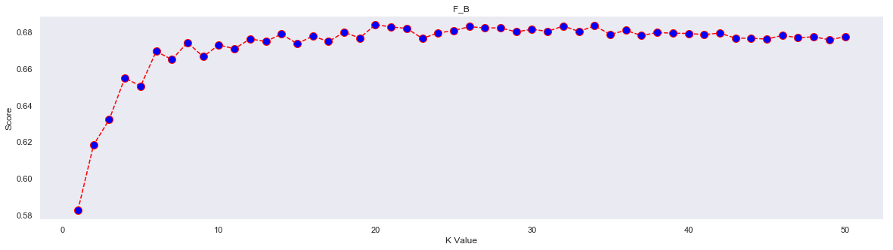

# Classification Modeling 

In this project, we will build a classification model using K-Nearest Neighbors(KNN) and Decision Trees, utilizing the following dataset:  https://www.openml.org/d/1590

### Import files


```python
import numpy as np
import pandas as pd
import seaborn as sns
import matplotlib.pyplot as plt
from sklearn import preprocessing
from sklearn.model_selection import train_test_split
from sklearn.neighbors import KNeighborsClassifier
from sklearn.metrics import f1_score, precision_score, accuracy_score, fbeta_score, recall_score
from sklearn.tree import DecisionTreeClassifier 
from sklearn.tree import export_graphviz
from IPython.display import Image  
from sklearn.tree import export_graphviz
from pydotplus import graph_from_dot_data

%matplotlib inline
%load_ext autoreload
%autoreload
```

    The autoreload extension is already loaded. To reload it, use:
      %reload_ext autoreload
    


```python
data = pd.read_csv('./data/phpMawTba.csv')
```

## Data Cleaning

Since this file was initally mined by someone else, it was relatively clean and ordered.
There were some additional operations needed to put the data in the proper format and to type cast certain columns.


```python
data.head()
```


<div>
<style scoped>
    .dataframe tbody tr th:only-of-type {
        vertical-align: middle;
    }

    .dataframe tbody tr th {
        vertical-align: top;
    }

    .dataframe thead th {
        text-align: right;
    }
</style>
<table border="1" class="dataframe">
  <thead>
    <tr style="text-align: right;">
      <th></th>
      <th>age</th>
      <th>workclass</th>
      <th>fnlwgt</th>
      <th>education</th>
      <th>education-num</th>
      <th>marital-status</th>
      <th>occupation</th>
      <th>relationship</th>
      <th>race</th>
      <th>sex</th>
      <th>capital-gain</th>
      <th>capital-loss</th>
      <th>hours-per-week</th>
      <th>native-country</th>
      <th>class</th>
    </tr>
  </thead>
  <tbody>
    <tr>
      <th>0</th>
      <td>25</td>
      <td>Private</td>
      <td>226802</td>
      <td>11th</td>
      <td>7</td>
      <td>Never-married</td>
      <td>Machine-op-inspct</td>
      <td>Own-child</td>
      <td>Black</td>
      <td>Male</td>
      <td>0</td>
      <td>0</td>
      <td>40</td>
      <td>United-States</td>
      <td>&lt;=50K</td>
    </tr>
    <tr>
      <th>1</th>
      <td>38</td>
      <td>Private</td>
      <td>89814</td>
      <td>HS-grad</td>
      <td>9</td>
      <td>Married-civ-spouse</td>
      <td>Farming-fishing</td>
      <td>Husband</td>
      <td>White</td>
      <td>Male</td>
      <td>0</td>
      <td>0</td>
      <td>50</td>
      <td>United-States</td>
      <td>&lt;=50K</td>
    </tr>
    <tr>
      <th>2</th>
      <td>28</td>
      <td>Local-gov</td>
      <td>336951</td>
      <td>Assoc-acdm</td>
      <td>12</td>
      <td>Married-civ-spouse</td>
      <td>Protective-serv</td>
      <td>Husband</td>
      <td>White</td>
      <td>Male</td>
      <td>0</td>
      <td>0</td>
      <td>40</td>
      <td>United-States</td>
      <td>&gt;50K</td>
    </tr>
    <tr>
      <th>3</th>
      <td>44</td>
      <td>Private</td>
      <td>160323</td>
      <td>Some-college</td>
      <td>10</td>
      <td>Married-civ-spouse</td>
      <td>Machine-op-inspct</td>
      <td>Husband</td>
      <td>Black</td>
      <td>Male</td>
      <td>7688</td>
      <td>0</td>
      <td>40</td>
      <td>United-States</td>
      <td>&gt;50K</td>
    </tr>
    <tr>
      <th>4</th>
      <td>18</td>
      <td>?</td>
      <td>103497</td>
      <td>Some-college</td>
      <td>10</td>
      <td>Never-married</td>
      <td>?</td>
      <td>Own-child</td>
      <td>White</td>
      <td>Female</td>
      <td>0</td>
      <td>0</td>
      <td>30</td>
      <td>United-States</td>
      <td>&lt;=50K</td>
    </tr>
  </tbody>
</table>
</div>


```python
data.info()
```

    <class 'pandas.core.frame.DataFrame'>
    RangeIndex: 48842 entries, 0 to 48841
    Data columns (total 15 columns):
    age               48842 non-null int64
    workclass         48842 non-null object
    fnlwgt            48842 non-null int64
    education         48842 non-null object
    education-num     48842 non-null int64
    marital-status    48842 non-null object
    occupation        48842 non-null object
    relationship      48842 non-null object
    race              48842 non-null object
    sex               48842 non-null object
    capital-gain      48842 non-null int64
    capital-loss      48842 non-null int64
    hours-per-week    48842 non-null int64
    native-country    48842 non-null object
    class             48842 non-null object
    dtypes: int64(6), object(9)
    memory usage: 5.6+ MB
    


```python
data.columns
```


    Index(['age', 'workclass', 'fnlwgt', 'education', 'education-num',
           'marital-status', 'occupation', 'relationship', 'race', 'sex',
           'capital-gain', 'capital-loss', 'hours-per-week', 'native-country',
           'class'],
          dtype='object')


```python
for col in data.columns:
    print(f'{col}\n{data[col].unique()}\n')
```

    age
    [25 38 28 44 18 34 29 63 24 55 65 36 26 58 48 43 20 37 40 72 45 22 23 54
     32 46 56 17 39 52 21 42 33 30 47 41 19 69 50 31 59 49 51 27 57 61 64 79
     73 53 77 80 62 35 68 66 75 60 67 71 70 90 81 74 78 82 83 85 76 84 89 88
     87 86]
    
    workclass
    [' Private' ' Local-gov' ' ?' ' Self-emp-not-inc' ' Federal-gov'
     ' State-gov' ' Self-emp-inc' ' Without-pay' ' Never-worked']
    
    fnlwgt
    [226802  89814 336951 ... 129912 255835 257302]
    
    education
    [' 11th' ' HS-grad' ' Assoc-acdm' ' Some-college' ' 10th' ' Prof-school'
     ' 7th-8th' ' Bachelors' ' Masters' ' Doctorate' ' 5th-6th' ' Assoc-voc'
     ' 9th' ' 12th' ' 1st-4th' ' Preschool']
    
    education-num
    [ 7  9 12 10  6 15  4 13 14 16  3 11  5  8  2  1]
    
    marital-status
    [' Never-married' ' Married-civ-spouse' ' Widowed' ' Divorced'
     ' Separated' ' Married-spouse-absent' ' Married-AF-spouse']
    
    occupation
    [' Machine-op-inspct' ' Farming-fishing' ' Protective-serv' ' ?'
     ' Other-service' ' Prof-specialty' ' Craft-repair' ' Adm-clerical'
     ' Exec-managerial' ' Tech-support' ' Sales' ' Priv-house-serv'
     ' Transport-moving' ' Handlers-cleaners' ' Armed-Forces']
    
    relationship
    [' Own-child' ' Husband' ' Not-in-family' ' Unmarried' ' Wife'
     ' Other-relative']
    
    race
    [' Black' ' White' ' Asian-Pac-Islander' ' Other' ' Amer-Indian-Eskimo']
    
    sex
    [' Male' ' Female']
    
    capital-gain
    [    0  7688  3103  6418  7298  3908 14084  5178 15024 99999  2597  2907
      4650  6497  1055  5013 27828  4934  4064  3674  2174 10605  3418   114
      2580  3411  4508  4386  8614 13550  6849  2463  3137  2885  2964  1471
     10566  2354  1424  1455  3325  4416 25236   594  2105  4787  2829   401
      4865  1264  1506 10520  3464  2653 20051  4101  1797  2407  3471  1086
      1848 14344  1151  2993  2290 15020  9386  2202  3818  2176  5455 11678
      7978  7262  6514 41310  3456  7430  2414  2062 34095  1831  6723  5060
     15831  2977  2346  3273  2329  9562  2635  4931  1731  6097   914  7896
      5556  1409  3781  3942  2538  3887 25124  7443  5721  1173  4687  6612
      6767  2961   991  2036  2936  2050  1111  2228 22040  3432  6360  2009
      1639 18481  2387]
    
    capital-loss
    [   0 1721 1876 2415 1887  625 1977 2057 1429 1590 1485 2051 2377 1672
     1628 1902 1602 1741 2444 1408 2001 2042 1740 1825 1848 1719 3004 2179
     1573 2205 1258 2339 1726 2258 1340 1504 2559 1668 1974 1980 1564 2547
     2002 1669 1617  323 3175 2472 2174 1579 2129 1510 1735 2282 1870 1411
     1911 1651 1092 1762 2457 2231 2238  653 1138 2246 2603 2392 1944 1380
     2465 1421 3770 1594  213 2149 2824 1844 2467 2163 1816 1648 2206 2352
      419 1539  880  810  974 4356 2489 1755 3683 2267 2080  155 3900 2201
     2754]
    
    hours-per-week
    [40 50 30 32 10 39 35 48 25 20 45 47  6 43 90 54 60 38 36 18 24 44 56 28
     16 41 22 55 14 33 37  8 12 70 15 75 52 84 42 80 68 99 65  5 17 72 53 29
     96 21 46  3  1 23 49 67 76  7  2 58 26 34  4 51 78 63 31 92 77 27 85 13
     19 98 62 66 57 11 86 59  9 64 73 61 88 79 89 74 69 87 97 94 82 91 81 95]
    
    native-country
    [' United-States' ' ?' ' Peru' ' Guatemala' ' Mexico'
     ' Dominican-Republic' ' Ireland' ' Germany' ' Philippines' ' Thailand'
     ' Haiti' ' El-Salvador' ' Puerto-Rico' ' Vietnam' ' South' ' Columbia'
     ' Japan' ' India' ' Cambodia' ' Poland' ' Laos' ' England' ' Cuba'
     ' Taiwan' ' Italy' ' Canada' ' Portugal' ' China' ' Nicaragua'
     ' Honduras' ' Iran' ' Scotland' ' Jamaica' ' Ecuador' ' Yugoslavia'
     ' Hungary' ' Hong' ' Greece' ' Trinadad&Tobago'
     ' Outlying-US(Guam-USVI-etc)' ' France' ' Holand-Netherlands']
    
    class
    [' <=50K' ' >50K']
    
    


```python
## This line of code takes care of trailing and leading whitespace within series that contain string objects
for col in data.columns:
    try:
        data[col] = data[col].apply(lambda x: x.strip())
    except:
        continue
        
data.head()
```


<div>
<style scoped>
    .dataframe tbody tr th:only-of-type {
        vertical-align: middle;
    }

    .dataframe tbody tr th {
        vertical-align: top;
    }

    .dataframe thead th {
        text-align: right;
    }
</style>
<table border="1" class="dataframe">
  <thead>
    <tr style="text-align: right;">
      <th></th>
      <th>age</th>
      <th>workclass</th>
      <th>fnlwgt</th>
      <th>education</th>
      <th>education-num</th>
      <th>marital-status</th>
      <th>occupation</th>
      <th>relationship</th>
      <th>race</th>
      <th>sex</th>
      <th>capital-gain</th>
      <th>capital-loss</th>
      <th>hours-per-week</th>
      <th>native-country</th>
      <th>class</th>
    </tr>
  </thead>
  <tbody>
    <tr>
      <th>0</th>
      <td>25</td>
      <td>Private</td>
      <td>226802</td>
      <td>11th</td>
      <td>7</td>
      <td>Never-married</td>
      <td>Machine-op-inspct</td>
      <td>Own-child</td>
      <td>Black</td>
      <td>Male</td>
      <td>0</td>
      <td>0</td>
      <td>40</td>
      <td>United-States</td>
      <td>&lt;=50K</td>
    </tr>
    <tr>
      <th>1</th>
      <td>38</td>
      <td>Private</td>
      <td>89814</td>
      <td>HS-grad</td>
      <td>9</td>
      <td>Married-civ-spouse</td>
      <td>Farming-fishing</td>
      <td>Husband</td>
      <td>White</td>
      <td>Male</td>
      <td>0</td>
      <td>0</td>
      <td>50</td>
      <td>United-States</td>
      <td>&lt;=50K</td>
    </tr>
    <tr>
      <th>2</th>
      <td>28</td>
      <td>Local-gov</td>
      <td>336951</td>
      <td>Assoc-acdm</td>
      <td>12</td>
      <td>Married-civ-spouse</td>
      <td>Protective-serv</td>
      <td>Husband</td>
      <td>White</td>
      <td>Male</td>
      <td>0</td>
      <td>0</td>
      <td>40</td>
      <td>United-States</td>
      <td>&gt;50K</td>
    </tr>
    <tr>
      <th>3</th>
      <td>44</td>
      <td>Private</td>
      <td>160323</td>
      <td>Some-college</td>
      <td>10</td>
      <td>Married-civ-spouse</td>
      <td>Machine-op-inspct</td>
      <td>Husband</td>
      <td>Black</td>
      <td>Male</td>
      <td>7688</td>
      <td>0</td>
      <td>40</td>
      <td>United-States</td>
      <td>&gt;50K</td>
    </tr>
    <tr>
      <th>4</th>
      <td>18</td>
      <td>?</td>
      <td>103497</td>
      <td>Some-college</td>
      <td>10</td>
      <td>Never-married</td>
      <td>?</td>
      <td>Own-child</td>
      <td>White</td>
      <td>Female</td>
      <td>0</td>
      <td>0</td>
      <td>30</td>
      <td>United-States</td>
      <td>&lt;=50K</td>
    </tr>
  </tbody>
</table>
</div>


```python
for col in data.columns:
    print(f'{col}\n{data[col].unique()}\n')
```

    age
    [25 38 28 44 18 34 29 63 24 55 65 36 26 58 48 43 20 37 40 72 45 22 23 54
     32 46 56 17 39 52 21 42 33 30 47 41 19 69 50 31 59 49 51 27 57 61 64 79
     73 53 77 80 62 35 68 66 75 60 67 71 70 90 81 74 78 82 83 85 76 84 89 88
     87 86]
    
    workclass
    ['Private' 'Local-gov' '?' 'Self-emp-not-inc' 'Federal-gov' 'State-gov'
     'Self-emp-inc' 'Without-pay' 'Never-worked']
    
    fnlwgt
    [226802  89814 336951 ... 129912 255835 257302]
    
    education
    ['11th' 'HS-grad' 'Assoc-acdm' 'Some-college' '10th' 'Prof-school'
     '7th-8th' 'Bachelors' 'Masters' 'Doctorate' '5th-6th' 'Assoc-voc' '9th'
     '12th' '1st-4th' 'Preschool']
    
    education-num
    [ 7  9 12 10  6 15  4 13 14 16  3 11  5  8  2  1]
    
    marital-status
    ['Never-married' 'Married-civ-spouse' 'Widowed' 'Divorced' 'Separated'
     'Married-spouse-absent' 'Married-AF-spouse']
    
    occupation
    ['Machine-op-inspct' 'Farming-fishing' 'Protective-serv' '?'
     'Other-service' 'Prof-specialty' 'Craft-repair' 'Adm-clerical'
     'Exec-managerial' 'Tech-support' 'Sales' 'Priv-house-serv'
     'Transport-moving' 'Handlers-cleaners' 'Armed-Forces']
    
    relationship
    ['Own-child' 'Husband' 'Not-in-family' 'Unmarried' 'Wife' 'Other-relative']
    
    race
    ['Black' 'White' 'Asian-Pac-Islander' 'Other' 'Amer-Indian-Eskimo']
    
    sex
    ['Male' 'Female']
    
    capital-gain
    [    0  7688  3103  6418  7298  3908 14084  5178 15024 99999  2597  2907
      4650  6497  1055  5013 27828  4934  4064  3674  2174 10605  3418   114
      2580  3411  4508  4386  8614 13550  6849  2463  3137  2885  2964  1471
     10566  2354  1424  1455  3325  4416 25236   594  2105  4787  2829   401
      4865  1264  1506 10520  3464  2653 20051  4101  1797  2407  3471  1086
      1848 14344  1151  2993  2290 15020  9386  2202  3818  2176  5455 11678
      7978  7262  6514 41310  3456  7430  2414  2062 34095  1831  6723  5060
     15831  2977  2346  3273  2329  9562  2635  4931  1731  6097   914  7896
      5556  1409  3781  3942  2538  3887 25124  7443  5721  1173  4687  6612
      6767  2961   991  2036  2936  2050  1111  2228 22040  3432  6360  2009
      1639 18481  2387]
    
    capital-loss
    [   0 1721 1876 2415 1887  625 1977 2057 1429 1590 1485 2051 2377 1672
     1628 1902 1602 1741 2444 1408 2001 2042 1740 1825 1848 1719 3004 2179
     1573 2205 1258 2339 1726 2258 1340 1504 2559 1668 1974 1980 1564 2547
     2002 1669 1617  323 3175 2472 2174 1579 2129 1510 1735 2282 1870 1411
     1911 1651 1092 1762 2457 2231 2238  653 1138 2246 2603 2392 1944 1380
     2465 1421 3770 1594  213 2149 2824 1844 2467 2163 1816 1648 2206 2352
      419 1539  880  810  974 4356 2489 1755 3683 2267 2080  155 3900 2201
     2754]
    
    hours-per-week
    [40 50 30 32 10 39 35 48 25 20 45 47  6 43 90 54 60 38 36 18 24 44 56 28
     16 41 22 55 14 33 37  8 12 70 15 75 52 84 42 80 68 99 65  5 17 72 53 29
     96 21 46  3  1 23 49 67 76  7  2 58 26 34  4 51 78 63 31 92 77 27 85 13
     19 98 62 66 57 11 86 59  9 64 73 61 88 79 89 74 69 87 97 94 82 91 81 95]
    
    native-country
    ['United-States' '?' 'Peru' 'Guatemala' 'Mexico' 'Dominican-Republic'
     'Ireland' 'Germany' 'Philippines' 'Thailand' 'Haiti' 'El-Salvador'
     'Puerto-Rico' 'Vietnam' 'South' 'Columbia' 'Japan' 'India' 'Cambodia'
     'Poland' 'Laos' 'England' 'Cuba' 'Taiwan' 'Italy' 'Canada' 'Portugal'
     'China' 'Nicaragua' 'Honduras' 'Iran' 'Scotland' 'Jamaica' 'Ecuador'
     'Yugoslavia' 'Hungary' 'Hong' 'Greece' 'Trinadad&Tobago'
     'Outlying-US(Guam-USVI-etc)' 'France' 'Holand-Netherlands']
    
    class
    ['<=50K' '>50K']
    
    


```python
data.head()
```


<div>
<style scoped>
    .dataframe tbody tr th:only-of-type {
        vertical-align: middle;
    }

    .dataframe tbody tr th {
        vertical-align: top;
    }

    .dataframe thead th {
        text-align: right;
    }
</style>
<table border="1" class="dataframe">
  <thead>
    <tr style="text-align: right;">
      <th></th>
      <th>age</th>
      <th>workclass</th>
      <th>fnlwgt</th>
      <th>education</th>
      <th>education-num</th>
      <th>marital-status</th>
      <th>occupation</th>
      <th>relationship</th>
      <th>race</th>
      <th>sex</th>
      <th>capital-gain</th>
      <th>capital-loss</th>
      <th>hours-per-week</th>
      <th>native-country</th>
      <th>class</th>
    </tr>
  </thead>
  <tbody>
    <tr>
      <th>0</th>
      <td>25</td>
      <td>Private</td>
      <td>226802</td>
      <td>11th</td>
      <td>7</td>
      <td>Never-married</td>
      <td>Machine-op-inspct</td>
      <td>Own-child</td>
      <td>Black</td>
      <td>Male</td>
      <td>0</td>
      <td>0</td>
      <td>40</td>
      <td>United-States</td>
      <td>&lt;=50K</td>
    </tr>
    <tr>
      <th>1</th>
      <td>38</td>
      <td>Private</td>
      <td>89814</td>
      <td>HS-grad</td>
      <td>9</td>
      <td>Married-civ-spouse</td>
      <td>Farming-fishing</td>
      <td>Husband</td>
      <td>White</td>
      <td>Male</td>
      <td>0</td>
      <td>0</td>
      <td>50</td>
      <td>United-States</td>
      <td>&lt;=50K</td>
    </tr>
    <tr>
      <th>2</th>
      <td>28</td>
      <td>Local-gov</td>
      <td>336951</td>
      <td>Assoc-acdm</td>
      <td>12</td>
      <td>Married-civ-spouse</td>
      <td>Protective-serv</td>
      <td>Husband</td>
      <td>White</td>
      <td>Male</td>
      <td>0</td>
      <td>0</td>
      <td>40</td>
      <td>United-States</td>
      <td>&gt;50K</td>
    </tr>
    <tr>
      <th>3</th>
      <td>44</td>
      <td>Private</td>
      <td>160323</td>
      <td>Some-college</td>
      <td>10</td>
      <td>Married-civ-spouse</td>
      <td>Machine-op-inspct</td>
      <td>Husband</td>
      <td>Black</td>
      <td>Male</td>
      <td>7688</td>
      <td>0</td>
      <td>40</td>
      <td>United-States</td>
      <td>&gt;50K</td>
    </tr>
    <tr>
      <th>4</th>
      <td>18</td>
      <td>?</td>
      <td>103497</td>
      <td>Some-college</td>
      <td>10</td>
      <td>Never-married</td>
      <td>?</td>
      <td>Own-child</td>
      <td>White</td>
      <td>Female</td>
      <td>0</td>
      <td>0</td>
      <td>30</td>
      <td>United-States</td>
      <td>&lt;=50K</td>
    </tr>
  </tbody>
</table>
</div>


### Visualization 


```python
sns.catplot(x='sex', kind='count', data=data, aspect=2.5)
plt.xticks(rotation=45)
plt.show()
```


```python
sns.catplot(x='sex', kind='count', hue='class', data=data, aspect=2.5, )
plt.xticks(rotation=45)
plt.show()
```


```python
sns.catplot(x='education', kind='count', hue='sex', data=data, aspect=2.5)
plt.xticks(rotation=45)
plt.show()
```


```python
sns.catplot(x='occupation', kind='count', hue='sex', data=data, aspect=2.5)
plt.xticks(rotation=45)
plt.show()
```


```python
sns.catplot(x='occupation', kind='count', hue='class', data=data, aspect=2.5)
plt.xticks(rotation=45)
plt.show()
```


```python
sns.catplot(x='education', kind='count', hue='class', data=data, aspect=2.5)
plt.xticks(rotation=45)
plt.show()
```


# Classification modeling

In this section, we will create classification models using K-nearest neighbors and Decision Tree models.


### Setting up the data for modeling


```python
def encode_cat_labels(df, cols=None):
    new_df = df.copy()
    refs = {}
    
    if cols == None:
        cols = [col for col in data.columns if data[col].dtype == 'object']
    
    for col in cols:
        le = preprocessing.LabelEncoder()
        le.fit(data[col])
        new_df[col] = le.transform(new_df[col])
        refs[col] = {k:v for (k,v) in zip(le.classes_, le.transform(le.classes_))}
    return new_df, refs
```


```python
def calc_metrics(labels, preds, beta=0.5):
    
    metrics = {
        "precision": precision_score(labels, preds),
        "recall" : recall_score(labels, preds),
        "accuracy": accuracy_score(labels, preds),
        "f1": f1_score(labels, preds),
        "f_b": fbeta_score(labels, preds, beta=beta),
        "error": np.mean(labels != preds)
    }
    return metrics
```


```python
# Get all of the string columns within the dataframe
cols = [col for col in data.columns if data[col].dtype == 'object']
model_df, col_refs= encode_cat_labels(data, cols)

col_refs
```


    {'workclass': {'?': 0,
      'Federal-gov': 1,
      'Local-gov': 2,
      'Never-worked': 3,
      'Private': 4,
      'Self-emp-inc': 5,
      'Self-emp-not-inc': 6,
      'State-gov': 7,
      'Without-pay': 8},
     'education': {'10th': 0,
      '11th': 1,
      '12th': 2,
      '1st-4th': 3,
      '5th-6th': 4,
      '7th-8th': 5,
      '9th': 6,
      'Assoc-acdm': 7,
      'Assoc-voc': 8,
      'Bachelors': 9,
      'Doctorate': 10,
      'HS-grad': 11,
      'Masters': 12,
      'Preschool': 13,
      'Prof-school': 14,
      'Some-college': 15},
     'marital-status': {'Divorced': 0,
      'Married-AF-spouse': 1,
      'Married-civ-spouse': 2,
      'Married-spouse-absent': 3,
      'Never-married': 4,
      'Separated': 5,
      'Widowed': 6},
     'occupation': {'?': 0,
      'Adm-clerical': 1,
      'Armed-Forces': 2,
      'Craft-repair': 3,
      'Exec-managerial': 4,
      'Farming-fishing': 5,
      'Handlers-cleaners': 6,
      'Machine-op-inspct': 7,
      'Other-service': 8,
      'Priv-house-serv': 9,
      'Prof-specialty': 10,
      'Protective-serv': 11,
      'Sales': 12,
      'Tech-support': 13,
      'Transport-moving': 14},
     'relationship': {'Husband': 0,
      'Not-in-family': 1,
      'Other-relative': 2,
      'Own-child': 3,
      'Unmarried': 4,
      'Wife': 5},
     'race': {'Amer-Indian-Eskimo': 0,
      'Asian-Pac-Islander': 1,
      'Black': 2,
      'Other': 3,
      'White': 4},
     'sex': {'Female': 0, 'Male': 1},
     'native-country': {'?': 0,
      'Cambodia': 1,
      'Canada': 2,
      'China': 3,
      'Columbia': 4,
      'Cuba': 5,
      'Dominican-Republic': 6,
      'Ecuador': 7,
      'El-Salvador': 8,
      'England': 9,
      'France': 10,
      'Germany': 11,
      'Greece': 12,
      'Guatemala': 13,
      'Haiti': 14,
      'Holand-Netherlands': 15,
      'Honduras': 16,
      'Hong': 17,
      'Hungary': 18,
      'India': 19,
      'Iran': 20,
      'Ireland': 21,
      'Italy': 22,
      'Jamaica': 23,
      'Japan': 24,
      'Laos': 25,
      'Mexico': 26,
      'Nicaragua': 27,
      'Outlying-US(Guam-USVI-etc)': 28,
      'Peru': 29,
      'Philippines': 30,
      'Poland': 31,
      'Portugal': 32,
      'Puerto-Rico': 33,
      'Scotland': 34,
      'South': 35,
      'Taiwan': 36,
      'Thailand': 37,
      'Trinadad&Tobago': 38,
      'United-States': 39,
      'Vietnam': 40,
      'Yugoslavia': 41},
     'class': {'<=50K': 0, '>50K': 1}}


```python
model_df.head()
```


<div>
<style scoped>
    .dataframe tbody tr th:only-of-type {
        vertical-align: middle;
    }

    .dataframe tbody tr th {
        vertical-align: top;
    }

    .dataframe thead th {
        text-align: right;
    }
</style>
<table border="1" class="dataframe">
  <thead>
    <tr style="text-align: right;">
      <th></th>
      <th>age</th>
      <th>workclass</th>
      <th>fnlwgt</th>
      <th>education</th>
      <th>education-num</th>
      <th>marital-status</th>
      <th>occupation</th>
      <th>relationship</th>
      <th>race</th>
      <th>sex</th>
      <th>capital-gain</th>
      <th>capital-loss</th>
      <th>hours-per-week</th>
      <th>native-country</th>
      <th>class</th>
    </tr>
  </thead>
  <tbody>
    <tr>
      <th>0</th>
      <td>25</td>
      <td>4</td>
      <td>226802</td>
      <td>1</td>
      <td>7</td>
      <td>4</td>
      <td>7</td>
      <td>3</td>
      <td>2</td>
      <td>1</td>
      <td>0</td>
      <td>0</td>
      <td>40</td>
      <td>39</td>
      <td>0</td>
    </tr>
    <tr>
      <th>1</th>
      <td>38</td>
      <td>4</td>
      <td>89814</td>
      <td>11</td>
      <td>9</td>
      <td>2</td>
      <td>5</td>
      <td>0</td>
      <td>4</td>
      <td>1</td>
      <td>0</td>
      <td>0</td>
      <td>50</td>
      <td>39</td>
      <td>0</td>
    </tr>
    <tr>
      <th>2</th>
      <td>28</td>
      <td>2</td>
      <td>336951</td>
      <td>7</td>
      <td>12</td>
      <td>2</td>
      <td>11</td>
      <td>0</td>
      <td>4</td>
      <td>1</td>
      <td>0</td>
      <td>0</td>
      <td>40</td>
      <td>39</td>
      <td>1</td>
    </tr>
    <tr>
      <th>3</th>
      <td>44</td>
      <td>4</td>
      <td>160323</td>
      <td>15</td>
      <td>10</td>
      <td>2</td>
      <td>7</td>
      <td>0</td>
      <td>2</td>
      <td>1</td>
      <td>7688</td>
      <td>0</td>
      <td>40</td>
      <td>39</td>
      <td>1</td>
    </tr>
    <tr>
      <th>4</th>
      <td>18</td>
      <td>0</td>
      <td>103497</td>
      <td>15</td>
      <td>10</td>
      <td>4</td>
      <td>0</td>
      <td>3</td>
      <td>4</td>
      <td>0</td>
      <td>0</td>
      <td>0</td>
      <td>30</td>
      <td>39</td>
      <td>0</td>
    </tr>
  </tbody>
</table>
</div>


```python
target_name = 'class'
try:
    target = model_df[target_name]
    model_df.drop(labels=target_name, inplace=True, axis=1)
except:
    print(f'The target: {target_name}, has already been dropped from the dataframe')
    print(model_df.columns)
```

### Train Test Split


```python
##Setting up the train_test split
x_train, x_test,y_train, y_test = train_test_split(model_df, 
                                                    target, test_size=0.35, random_state=42)

# Instantiate StandardScaler
scaler = preprocessing.StandardScaler()

# Transform the training and test sets
scaled_data_train = scaler.fit_transform(x_train)
scaled_data_test = scaler.transform(x_test)
```

    C:\Users\Rahkeem\Anaconda3\envs\learn-env\lib\site-packages\sklearn\preprocessing\data.py:625: DataConversionWarning: Data with input dtype int32, int64 were all converted to float64 by StandardScaler.
      return self.partial_fit(X, y)
    C:\Users\Rahkeem\Anaconda3\envs\learn-env\lib\site-packages\sklearn\base.py:462: DataConversionWarning: Data with input dtype int32, int64 were all converted to float64 by StandardScaler.
      return self.fit(X, **fit_params).transform(X)
    C:\Users\Rahkeem\Anaconda3\envs\learn-env\lib\site-packages\ipykernel_launcher.py:10: DataConversionWarning: Data with input dtype int32, int64 were all converted to float64 by StandardScaler.
      # Remove the CWD from sys.path while we load stuff.
    


```python
x_train.shape, x_test.shape
```


    ((31747, 14), (17095, 14))


## K-nearest neighbors modeling


```python
def generate_knn(X_train, y_train, X_test, y_test, min_k=1, max_k=25):
    
    neighbors = [] # list to hold metrics of the neighbors
    for k in range(min_k, max_k+1):
        clf = KNeighborsClassifier(n_neighbors=k)
        clf.fit(X_train, y_train)
        preds = clf.predict(X_test)
        metrics = calc_metrics(labels=y_test, preds=preds)
        
        metrics['k'] = k # append k_value to the calculated metrics
        neighbors.append(metrics)
          
    return neighbors
```


```python
list_of_neighbors = generate_knn(x_train, y_train, x_test, y_test, max_k=50)
```


```python
# Print the last 5 elements of the list
list_of_neighbors[-5:]
```


    [{'precision': 0.9026217228464419,
      'recall': 0.17953811770548794,
      'accuracy': 0.8021643755484059,
      'f1': 0.29950289975144984,
      'f_b': 0.49993085327064035,
      'error': 0.19783562445159403,
      'k': 46},
     {'precision': 0.8990147783251231,
      'recall': 0.18127638440526447,
      'accuracy': 0.8023398654577362,
      'f1': 0.3017152304195082,
      'f_b': 0.5017182130584192,
      'error': 0.19766013454226383,
      'k': 47},
     {'precision': 0.9064102564102564,
      'recall': 0.17556493667742737,
      'accuracy': 0.8015209125475286,
      'f1': 0.2941543582275848,
      'f_b': 0.49461312438785504,
      'error': 0.19847908745247148,
      'k': 48},
     {'precision': 0.9021329987452948,
      'recall': 0.1785448224484728,
      'accuracy': 0.8019303890026324,
      'f1': 0.2980928689883913,
      'f_b': 0.4982674982674982,
      'error': 0.19806961099736764,
      'k': 49},
     {'precision': 0.9116094986807388,
      'recall': 0.17159175564936677,
      'accuracy': 0.8009359461830945,
      'f1': 0.2888192267502613,
      'f_b': 0.4894460971809038,
      'error': 0.19906405381690553,
      'k': 50}]


```python
def graph_knn_metrics(list_of_neighbors, fsize=(15,8)):
    graphs = {}
    
    # Pull the values from the dictionaries and store in list format
    for item in list_of_neighbors:
        keys =  item.keys()
        for key in keys:
            if key in graphs:
                graphs[key].append(item[key])
            else:
                graphs[key] = [item[key]]
    
    # Graph the values within the list
    for key in keys:
        if key != 'k':
            plt.figure(figsize=fsize)
            plt.plot(graphs['k'], graphs[key], color='red', linestyle='dashed', marker='o',
                     markerfacecolor='blue', markersize=10)
            plt.grid()
            plt.title(f'{key.upper()}')
            plt.xlabel('K Value')
            plt.ylabel('Score')
```


```python
graph_knn_metrics(list_of_neighbors, fsize=(20,5))
```


## Decision Tree Modeling

In this section, we will setup a base decision tree and also attempt to increase the performance of the tree via the following hyper parametres: `max_depth` and `max_features`

#### Base decision tree


```python
clf = DecisionTreeClassifier(criterion='entropy')
clf.fit(x_train, y_train)
y_preds = clf.predict(x_test)
calc_metrics(y_test, y_preds)
```


    {'precision': 0.6055871212121212,
     'recall': 0.635212316861187,
     'accuracy': 0.8166130447499269,
     'f1': 0.6200460550236334,
     'f_b': 0.6112890120919563,
     'error': 0.18338695525007312}


### Decision Tree with hyper parameter tunning: `max_features` 


```python
def graph_dt_metrics(list_of_metrics, fsize=(15,8), title='', x_label=''):
    graphs = {}
    
    # Pull the values from the dictionaries and store in list format
    for item in list_of_metrics:
        keys =  item.keys()
        for key in keys:
            if key in graphs:
                graphs[key].append(item[key])
            else:
                graphs[key] = [item[key]]
        
    # Graph the values within the list
    for key in keys:
        plt.figure(figsize=fsize)
        plt.plot(range(1, len(graphs[key])+1), graphs[key], color='blue', linestyle='dashed', marker='o',
                 markerfacecolor='red', markersize=10)
        plt.grid()
        plt.title(f'{title}\n{key.upper()}')
        plt.xlabel(x_label)
        plt.ylabel('score')
```


```python
max_feat_metrics = []
for i in range(1, len(model_df.columns)+1 ):
    clf = DecisionTreeClassifier(criterion='entropy', max_features=i)
    clf.fit(x_train, y_train)
    y_preds = clf.predict(x_test)

    max_feat_metrics.append(calc_metrics(y_test, y_preds))

max_feat_metrics
```


    [{'precision': 0.5831348261076703,
      'recall': 0.6078966972932704,
      'accuracy': 0.8052646972799065,
      'f1': 0.595258358662614,
      'f_b': 0.5879244920505308,
      'error': 0.1947353027200936},
     {'precision': 0.6103736479842674,
      'recall': 0.616588030792153,
      'accuracy': 0.8169640245685873,
      'f1': 0.6134651019147622,
      'f_b': 0.611606483077984,
      'error': 0.1830359754314127},
     {'precision': 0.6058608058608058,
      'recall': 0.6160913831636454,
      'accuracy': 0.8151506288388418,
      'f1': 0.6109332676680621,
      'f_b': 0.6078796491400009,
      'error': 0.18484937116115824},
     {'precision': 0.6171538092956397,
      'recall': 0.6396821455177552,
      'accuracy': 0.8216437554840597,
      'f1': 0.628216071210828,
      'f_b': 0.6215316315205327,
      'error': 0.17835624451594034},
     {'precision': 0.6182123978856319,
      'recall': 0.6389371740749938,
      'accuracy': 0.82199473530272,
      'f1': 0.6284039565270485,
      'f_b': 0.6222490931076179,
      'error': 0.1780052646972799},
     {'precision': 0.6154031287605295,
      'recall': 0.6349639930469332,
      'accuracy': 0.820532319391635,
      'f1': 0.6250305548765583,
      'f_b': 0.619218288371192,
      'error': 0.17946768060836502},
     {'precision': 0.6078755010610705,
      'recall': 0.6401787931462627,
      'accuracy': 0.8179584673881252,
      'f1': 0.6236090953072085,
      'f_b': 0.6140726978228764,
      'error': 0.1820415326118748},
     {'precision': 0.6140392908481074,
      'recall': 0.6364539359324559,
      'accuracy': 0.8201228429365311,
      'f1': 0.6250457261309597,
      'f_b': 0.6183950200260581,
      'error': 0.17987715706346885},
     {'precision': 0.6111763324724113,
      'recall': 0.6463868885026074,
      'accuracy': 0.8198303597543142,
      'f1': 0.6282886797006999,
      'f_b': 0.6179081802212409,
      'error': 0.18016964024568588},
     {'precision': 0.6149439006922893,
      'recall': 0.6396821455177552,
      'accuracy': 0.8207663059374086,
      'f1': 0.6270691333982473,
      'f_b': 0.6197372852812394,
      'error': 0.1792336940625914},
     {'precision': 0.6135922330097088,
      'recall': 0.6277626024335734,
      'accuracy': 0.8191868967534367,
      'f1': 0.6205965386031668,
      'f_b': 0.616374896376847,
      'error': 0.18081310324656333},
     {'precision': 0.6055175666116482,
      'recall': 0.6376955550037249,
      'accuracy': 0.816788534659257,
      'f1': 0.6211901306240928,
      'f_b': 0.6116907245962555,
      'error': 0.1832114653407429},
     {'precision': 0.6115193173737853,
      'recall': 0.6406754407747703,
      'accuracy': 0.8194793799356537,
      'f1': 0.6257579432452097,
      'f_b': 0.6171362962254222,
      'error': 0.1805206200643463},
     {'precision': 0.6071942446043166,
      'recall': 0.6287558976905885,
      'accuracy': 0.8167300380228137,
      'f1': 0.6177869952421619,
      'f_b': 0.611387453518134,
      'error': 0.1832699619771863}]


```python
graph_dt_metrics(max_feat_metrics, fsize=(13,5), title='Max_Features', x_label='max features')
```


### Decision Tree hyper parameter tunning: `max_depth`


```python
max_depth_metrics = []
for i in range(1, 100):
    clf = DecisionTreeClassifier(criterion='entropy', max_depth=i)
    clf.fit(x_train, y_train)
    y_preds = clf.predict(x_test)

    max_depth_metrics.append(calc_metrics(y_test, y_preds))
```

    C:\Users\Rahkeem\Anaconda3\envs\learn-env\lib\site-packages\sklearn\metrics\classification.py:1143: UndefinedMetricWarning: Precision is ill-defined and being set to 0.0 due to no predicted samples.
      'precision', 'predicted', average, warn_for)
    C:\Users\Rahkeem\Anaconda3\envs\learn-env\lib\site-packages\sklearn\metrics\classification.py:1143: UndefinedMetricWarning: F-score is ill-defined and being set to 0.0 due to no predicted samples.
      'precision', 'predicted', average, warn_for)
    C:\Users\Rahkeem\Anaconda3\envs\learn-env\lib\site-packages\sklearn\metrics\classification.py:1143: UndefinedMetricWarning: F-score is ill-defined and being set to 0.0 due to no predicted samples.
      'precision', 'predicted', average, warn_for)
    


```python
graph_dt_metrics(max_depth_metrics, fsize=(15,5), title='Max_Depth', x_label='max_depth')
```





### Decision tree hyper parameter tunning: `max_features: 12` & `max_depth`


```python
feat_depth_metrics = []
for i in range(1, 100):
    clf = DecisionTreeClassifier(criterion='entropy', max_depth=i, max_features=12)
    clf.fit(x_train, y_train)
    y_preds = clf.predict(x_test)

    feat_depth_metrics.append(calc_metrics(y_test, y_preds))
```

    C:\Users\Rahkeem\Anaconda3\envs\learn-env\lib\site-packages\sklearn\metrics\classification.py:1143: UndefinedMetricWarning: Precision is ill-defined and being set to 0.0 due to no predicted samples.
      'precision', 'predicted', average, warn_for)
    C:\Users\Rahkeem\Anaconda3\envs\learn-env\lib\site-packages\sklearn\metrics\classification.py:1143: UndefinedMetricWarning: F-score is ill-defined and being set to 0.0 due to no predicted samples.
      'precision', 'predicted', average, warn_for)
    C:\Users\Rahkeem\Anaconda3\envs\learn-env\lib\site-packages\sklearn\metrics\classification.py:1143: UndefinedMetricWarning: F-score is ill-defined and being set to 0.0 due to no predicted samples.
      'precision', 'predicted', average, warn_for)
    


```python
graph_dt_metrics(feat_depth_metrics, title="Max_feat: 12", x_label='max_depth')
```


```python
feat_depth_metrics[10]
```


    {'precision': 0.7253052164261932,
     'recall': 0.6491184504593991,
     'accuracy': 0.859432582626499,
     'f1': 0.6851002489844057,
     'f_b': 0.7086699560808979,
     'error': 0.14056741737350104}


# Summary

In this project, we sought to create a classification model using K-Nearest Neighbors and Decision Trees.  The packages used to model these

### KNN

The KNN model produced strong results.  The highest overall metrics were seen in .  Since this modeling technique utilizes voting, the decision was made to only utilize odd values when calculating the nearest neighbors.

One thing that was noted was that the precision of our model increased as more values were used for k.  I am not sure as to what may have caused this.  This modeling technique performed well with regards to precision, lowest error rate, and accuracy, but did poorly the remaining measures

### Decision Trees 

The best overall results within our Decision Tree Modeling utilized the following hyper parameters: `max_depth: 11` & `max_features: 12`. It is important to note that this tree did not have the highest score in each respective measure.  As different combinations were added, some measure increased, while others decreased. I decided to pick the tree with the smallest overall margin of change in the measures used.  

We used an iterative process to find the best combination of these hyper parameters that would give us an optimum decision tree. Although there are many combinations of hyper parameters that could be used, we decided to only use max_depth and max_features, to simplify the project.

Below are the overall scores of the decision


```python
feat_depth_metrics[10]
```


    {'precision': 0.7253052164261932,
     'recall': 0.6491184504593991,
     'accuracy': 0.859432582626499,
     'f1': 0.6851002489844057,
     'f_b': 0.7086699560808979,
     'error': 0.14056741737350104}


### Conclusion

The Decision Tree that resulted from our hyper parameter tunning that gave the overall best performance and the most consistent results.  Our KNN Model has some very interesting results and unexpected results.  More research would have to be done to determine the cause of the these results.  We were able to accurately predict 86% of our test data.

## Future Works

Possible future addition, or editions, to this project include the following:
* Pulling more recent data to see how demographics have increased over the years
* Web scrapping with the census bureau website to automatically update the data used.
